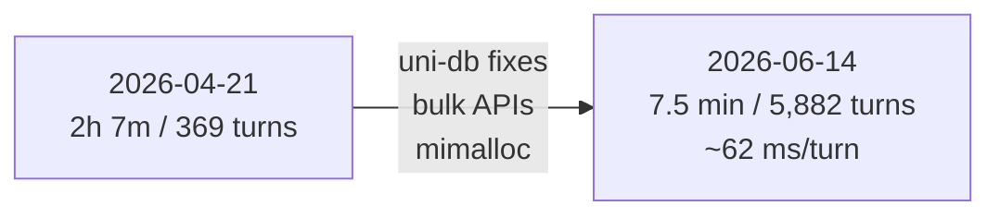

# Benchmarks

Every figure here is traceable to a committed artifact. Each section opens with the outcome it
proves — cost, latency, or operational footprint — then shows the measured numbers. uniko is
measured on the full **LoCoMo10** benchmark (1,986 questions) and against the KTH **dmas-memory**
testbed of five other memory systems, plus a set of write-path microbenchmarks.

---

## Ingest costs you nothing, and finishes in minutes

Ingest extracts entities and observations through a local INT8 ONNX cascade (kniv-deberta) with
**zero LLM API calls** — $0 in ingest tokens by construction. The full 5,882-turn LoCoMo corpus
loads in **7.5 minutes**, ~76 ms/turn.

| System | Total $ | Tokens | Wall (min) | per-turn ms |
|---|---|---|---|---|
| **uniko** | **~$0** | **0** (local NLP) | **7.5** | **76** |
| full_context | $0.00 | 0 | 21.08 | ~215 |
| rag | $0.006 | 308k | 40.29 | ~411 |
| cognee | $1.32 | 6.7M | 493.47 | ~5031 |
| mem0 | $4.82 | 51.7M | 250.95 | ~2560 |
| graphiti | $5.49 | 34.6M | 568.97 | ~5804 |

Against the graph backends (Graphiti, Cognee), uniko is **33–76× faster** at the per-turn level
and avoids $1.32–$5.49 of ingest cost per corpus. *(KTH dmas-memory comparison,
[arXiv:2601.07978](https://arxiv.org/abs/2601.07978), measured 2026-06-14.)*

---

## Queries return in 4 seconds, with the fewest tokens

uniko answers in **4.04s** mean wall time — the **fastest of all six systems measured** — using
**2,468** total tokens per query.

| System | Answer $/q | Total $ (1540 q) | Avg wall | Ctx-in tok | Total tok |
|---|---|---|---|---|---|
| mem0 | $0.000179 | $0.28 | 4.56s | 752 | 1235 |
| rag | $0.000259 | $0.40 | 4.34s | 1308 | 1790 |
| **uniko** | $0.000657 | $1.01 | **4.04s** | 2435 | **2468** |
| graphiti | $0.000657 | $1.01 | 6.20s | 2174 | 4546 |
| cognee | $0.000715 | $1.10 | 6.99s | 248 | 4780 |
| full_context | $0.006786 | $10.45 | 9.51s | 44312 | 45708 |

- **Fastest Q&A wall time of all six systems** (4.04s). The two graph backends are 53% (Graphiti)
  and 73% (Cognee) slower.
- **Half the total LLM tokens per query** of either graph backend (2,468 vs Graphiti 4,546, Cognee
  4,780).
- Answer cost is driven by retrieved-context size (2,435 input tokens) — a recall-budget setting
  you tune, not an architectural floor.

---

## It runs with zero infrastructure

The entire suite — database, NLP cascade, embeddings, optional reranker — runs in one process on a
22-core CPU and an 8 GB consumer GPU. There is no Neo4j, Qdrant, or Postgres to operate, and no
network plane to constrain. Ingest has no per-message network dependency, so it stays fast and free
offline.

---

## Recall quality you can defend

uniko scores **0.8117 LLM-judge** accuracy on all 1,986 LoCoMo10 questions, with **0.8555**
retrieval hit, F1 **0.321**, at **$3.55** total LLM cost — judged with Mem0's verbatim prompt for
comparability.

| Metric | Value |
|---|---|
| LLM-judge (gemini-3.1) | **0.8117** |
| Retrieval hit | **0.8555** |
| F1 | **0.321** |
| Total LLM cost (answer + judge) | **$3.55** |
| Ingest wall time | **7.5 min** for 5,882 turns (~62 ms/turn) |
| Ingest API cost | **$0** |
| Mean Q&A latency | **4.04s** (2.22s recall + 1.19s generation) |

Published competitor judge scores on LoCoMo: Mem0 91.6%, Graphiti 75–84%, Letta 74.0%, LangMem
58.1%.

!!! note "Two source-faithful ingest rates"
    Both numbers describe the same 7.5 min / 5,882-turn run: **~76 ms/turn** is the wall-clock rate
    reported in the KTH comparison; **~62 ms/turn** is the steady-state post-warmup rate from
    `perf-journey.md`.

*Source: `data/locomo_gemini31_merged.json`, baseline dated 2026-05-26.*

---

## How these were measured

Both benchmarks feed an agent a long, multi-session conversation, ask questions about that history,
and score whether the right evidence was retrieved and the right answer produced.

- **LoCoMo** (10 conversations, 1,986 questions) measures end-to-end question answering across
  categories — single-hop, multi-hop, temporal, adversarial, open-domain — scored with an
  LLM-as-judge.
- **LongMemEval** measures retrieval quality on three question types: **SSU**
  (single-session-user), **SSA** (single-session-assistant), and **MS** (multi-session), scored
  with `contains`, R@5, and NDCG@5.

!!! note "Local-only ingest, LLM only for answer and judge"
    During ingest, uniko runs a local ONNX NLP cascade and makes **zero LLM API calls** — $0 in
    ingest tokens by construction. An LLM is invoked only at **answer time** (to generate the
    response) and, in evaluation, at **judge time** (to score it).

!!! note "Two question sets — don't conflate them"
    The 0.8117 judge figure is the full 1,986-question LoCoMo10 run; the KTH cost and latency tables
    above use the 1,540-question non-adversarial subset.

---

## Supporting evidence

### LongMemEval retrieval slice

An 11-question slice (5 SSU + 3 SSA + 3 MS), GPU, BGE-small 384d embedder, retrieval-only (no LLM
judge). Numbers are verbatim from the bench output JSON.

| Category | n | contains | R@5 | NDCG@5 |
|---|---|---|---|---|
| SSU | 5 | 1.000 | 1.000 | 1.000 |
| SSA | 3 | 0.333 | 1.000 | 1.000 |
| MS  | 3 | 0.667 | 0.667 | 0.650 |
| **ALL** | **11** | **0.727** | **0.909** | **0.905** |

!!! note "SSA is a chunking-strategy lever"
    On the 3 SSA questions, session-level retrieval is perfect (R@5 = 1.000 on all three) — the
    right session is always retrieved. On 2 of 3, the answer text simply isn't in that session's
    top-5 *chunks*. The Phase-1 gate measures chunk-level containment, so this is a
    chunking-strategy tuning lever, not a recall-algorithm gap. Adding the
    `cross-encoder/ms-marco-MiniLM-L-6-v2` reranker on the 6 non-SSU questions lifts aggregate R@5
    from 0.833 to **0.875** with no change in `contains` rate, at ~2× latency.

!!! note "Directional at n = 11"
    This slice is 11 questions; per-question variance is high (flipping one R@5 from 0.5 to 1.0
    moves a category average by ~0.17). Treat these as directional, and validate on your own
    workload.

*Source: uniko LongMemEval bench run (2026-05-17).*

### Perf journey: hours → minutes

The same-size LoCoMo conversation that took **2h 7m to ingest on 2026-04-21** now ingests at
~62 ms/turn — a ~22–28s ingest for the same 369-turn conversation, **≈ 300× faster**.

The April pathology was not a slow uniko algorithm — it was two uni-db bugs (a 600 ms retry-storm
per flush and an O(total_rows) index rebuild) that uniko isolated as minimal repros and filed
upstream. The ~300× win is a substrate win unlocked by that repro discipline, compounded by
uni-db's `bulk_insert` APIs and the `mimalloc` allocator (~3×). *Source: uniko perf-journey
records.*

### Microbenchmarks: bulk API vs Cypher `UNWIND`

uniko's ingest hot paths write through uni-db's bulk API (`bulk_insert_vertices` /
`bulk_insert_edges`) instead of Cypher `UNWIND … CREATE`. Measured on the real batch-size
distribution of LoCoMo conv-26 ingestion (419 turns, 19 sessions), median over 5 reps.

| Operation | Speedup | Detail |
|---|---|---|
| **Edges** | **524×** | ~2.6 µs vs ~1367 µs/op; 11.4 ms vs 5954 ms whole-conv |
| **Nodes (no embed)** | **49.6×** | 3.4 ms vs 167 ms |
| Nodes (with embed) | 1.4× | embedder dominates both arms |

!!! tip "The practical takeaway"
    Use the bulk API for **all edge writes** (the 524× gap is structural). Use it for node writes
    too, but the ~50× win applies only when the label is *not* auto-embedding — for auto-embed
    labels like Chunk and Observation, the embedder is the bottleneck and the write path is a
    rounding error.

*Source: uniko bulk-vs-unwind microbenchmark (uni-db 2.0.2, CPU, BGE-small).*

### Canonical current numbers

| Benchmark | Metric | Value | Date |
|---|---|---|---|
| LoCoMo10 (1,986q) | judge / hit / F1 / cost | **0.8117 / 0.8555 / 0.321 / $3.55** | 2026-05-26 |
| LoCoMo10 | ingest | **7.5 min / 5,882 turns / $0** (~62 ms/turn) | 2026-06-14 |
| LME 11q slice | contains / R@5 | **0.727 / 0.909** (retrieval-only) | 2026-05-17 |
| Bulk vs UNWIND | edges / nodes | **524× / 49.6×** | — |
