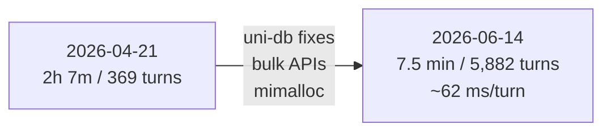

# Benchmarks

uniko is measured on two long-conversation memory benchmarks — **LoCoMo** and
**LongMemEval** — plus a competitive comparison against five other memory systems and a
set of write-path microbenchmarks. This page collects the numbers exactly as they appear
in the source measurement docs. Every figure here is traceable to a committed artifact.

## Methodology

Both benchmarks feed an agent a long, multi-session conversation, ask it questions about
that history, and score whether the right evidence was retrieved and the right answer
produced.

- **LoCoMo** (10 conversations, 1,986 questions) measures end-to-end question answering
  across categories — single-hop, multi-hop, temporal, adversarial, open-domain — scored
  with an LLM-as-judge.
- **LongMemEval** measures retrieval quality on three question types: **SSU**
  (single-session-user), **SSA** (single-session-assistant), and **MS** (multi-session),
  scored with `contains`, R@5, and NDCG@5.

The defining property of uniko's pipeline is **where the LLM is — and is not — used**:

!!! note "Local-only ingest, LLM only for answer and judge"
    During **ingest**, uniko runs a local ONNX NLP cascade (kniv-deberta, INT8) for entity
    and observation extraction and makes **zero LLM API calls**. An LLM is invoked only at
    **answer time** (to generate the final response) and, in evaluation, at **judge time**
    (to score the answer). Ingest cost is therefore $0 in API tokens by construction.

This is the structural reason uniko's ingest is fast and free where LLM-extraction backends
are network-bound and metered.

## LoCoMo10

The headline run is the full LoCoMo10 corpus — all 10 conversations, 1,986 questions —
judged by `gemini-3.1-pro-preview` (the judge uses Mem0's verbatim judge prompt for
comparability).

| Metric | Value |
|---|---|
| LLM-judge | **0.8117** |
| Retrieval hit | **0.8555** |
| F1 | **0.321** |
| Total LLM cost (answer + judge) | **$3.55** |
| Ingest wall time | **7.5 min** for 5,882 turns (~62 ms/turn) |
| Ingest API cost | **$0** |
| Mean Q&A latency | **4.04s** (2.22s recall + 1.19s generation) |

The mean Q&A latency of **4.04s** decomposes into recall and generation; ~62 ms/turn is
the steady-state per-turn cost after warmup; the wall-clock-averaged rate over all 5,882
turns is ~76 ms/turn.

!!! note "Two source-faithful ingest rates"
    Both numbers are correct for the same 7.5 min / 5,882-turn run: **~76 ms/turn** is the
    wall-clock rate (7.5 min / 5,882 turns) reported in the KTH comparison; **~62 ms/turn**
    is the steady-state post-warmup rate from `perf-journey.md`.

!!! tip "Why ingest is free"
    The ingest pipeline runs a local NLP cascade for extraction and makes no LLM calls per
    message. The LLM cost in the table is entirely the answer-generation and judging path,
    not extraction.

*Source: `data/locomo_gemini31_merged.json`, baseline dated 2026-05-26
(uniko perf-journey records).*

## LongMemEval

The committed LongMemEval measurement is an 11-question slice (5 SSU + 3 SSA + 3 MS),
GPU, BGE-small 384d embedder, **retrieval-only** (no LLM judge). Numbers below are verbatim
from the bench output JSON.

| Category | n | contains | R@5 | NDCG@5 |
|---|---|---|---|---|
| SSU | 5 | 1.000 | 1.000 | 1.000 |
| SSA | 3 | 0.333 | 1.000 | 1.000 |
| MS  | 3 | 0.667 | 0.667 | 0.650 |
| **ALL** | **11** | **0.727** | **0.909** | **0.905** |

The Phase-1 gate threshold is `context_contains_answer ≥ 90%`; this slice produces
**72.7%** and so **would fail** the gate. The gap is driven by SSA.

!!! warning "Known SSA chunking limitation — stated honestly"
    On the 3 SSA questions, **session-level retrieval is perfect** (R@5 = 1.000 on all
    three), but on 2 of 3 the answer text is not present in the top-5 *chunks* of the
    retrieved session. The Phase-1 gate measures chunk-level containment, not session-level
    recall. This is a **chunking-strategy** issue upstream of the recall cascade — a
    reranker rerun confirmed it: reranking cannot fix what chunking did not capture. On the
    6 non-SSU questions, enabling the `cross-encoder/ms-marco-MiniLM-L-6-v2` reranker moved
    aggregate R@5 from 0.833 to **0.875** with no change in `contains` rate, at roughly 2×
    latency.

!!! note "Small-n caveat"
    n = 11 is small. The 3-question SSA and MS slices have large per-question variance —
    flipping one R@5 between 0.5 and 1.0 swings a category average by ~0.17. These are
    directional measurements, not load-bearing defaults.

*Source: uniko LongMemEval bench run (2026-05-17).*

## Competitive comparison (KTH / DMAS)

uniko's LoCoMo numbers were compared against the KTH *dmas-memory* testbed (Wolff &
Bennati, arXiv:2601.07978), which runs five long-term-memory backends — mem0, Graphiti,
Cognee, RAG, and Full Context — through LoCoMo. The comparison uses the **unconstrained**
network regime (uniko has no network plane to constrain) and the 1,540 non-adversarial
questions to match the KTH set. Accuracy is deliberately excluded because the two runs
score answers by incomparable methods (KTH uses cosine + IDK; uniko uses an LLM judge).

### Loading phase — full 5,882-turn ingest

| System | Total $ | Tokens | Wall (min) | per-turn ms |
|---|---|---|---|---|
| **uniko** | **~$0** | **0** (local NLP) | **7.5** | **76** |
| full_context | $0.00 | 0 | 21.08 | ~215 |
| rag | $0.006 | 308k | 40.29 | ~411 |
| cognee | $1.32 | 6.7M | 493.47 | ~5031 |
| mem0 | $4.82 | 51.7M | 250.95 | ~2560 |
| graphiti | $5.49 | 34.6M | 568.97 | ~5804 |

uniko ingests the full corpus in **7.5 minutes at $0 API cost**, making **zero LLM API
calls during ingest**. Against the graph backends (Graphiti, Cognee), it is **33–76×
faster** at the per-turn level and avoids $1.32–$5.49 of ingest cost per corpus.

### Q&A phase — per-question cost / latency / tokens (N = 1,540)

| System | Answer $/q | Total $ (1540 q) | Avg wall | Ctx-in tok | Total tok |
|---|---|---|---|---|---|
| mem0 | $0.000179 | $0.28 | 4.56s | 752 | 1235 |
| rag | $0.000259 | $0.40 | 4.34s | 1308 | 1790 |
| **uniko** | $0.000657 | $1.01 | **4.04s** | 2435 | **2468** |
| graphiti | $0.000657 | $1.01 | 6.20s | 2174 | 4546 |
| cognee | $0.000715 | $1.10 | 6.99s | 248 | 4780 |
| full_context | $0.006786 | $10.45 | 9.51s | 44312 | 45708 |

Reading it:

- **uniko has the fastest Q&A wall time of all six systems** (**4.04s**). Graphiti and
  Cognee — the two graph backends — are 53% and 73% slower respectively.
- **uniko uses fewer total LLM tokens per query than either graph backend** (2,468 vs
  Graphiti 4,546, Cognee 4,780) — roughly half.
- uniko's answer cost **ties Graphiti** ($0.000657/q) and is ~3.7× mem0's. The driver is
  retrieved-context size (2,435 input tokens vs mem0's 752) — a recall-budget tuning lever,
  not an architectural floor.

!!! note "Where uniko wins, and where it trails"
    uniko wins decisively on **ingest throughput, ingest cost, end-to-end query latency,
    and per-query token efficiency vs graph systems**. It trails on **Q&A cost-per-question
    vs mem0**, entirely attributable to larger retrieved context — tunable via the recall
    token budget.

*Source: uniko KTH dmas-memory comparison (measured 2026-06-14).*

## Perf journey: hours → minutes

The same-size LoCoMo conversation that took **2h 7m to ingest on 2026-04-21** now ingests
at ~62 ms/turn — a ~22–28s ingest for the same 369-turn conversation, **≈ 300× faster**.

The April pathology was not a slow uniko algorithm — it was two uni-db bugs (a 600 ms
retry-storm per flush and an O(total_rows) index rebuild) that uniko isolated as minimal
repros and filed upstream. The ~300× win is predominantly a substrate win unlocked by that
repro discipline, compounded by uni-db's `bulk_insert` APIs (bulk writes) and the
`mimalloc` allocator (~3×).

*Source: uniko perf-journey records.*

## Microbenchmarks: bulk API vs Cypher `UNWIND`

uniko's ingest hot paths write through uni-db's bulk API
(`bulk_insert_vertices` / `bulk_insert_edges`) instead of Cypher `UNWIND … CREATE`. The
following are measured on the **real** batch-size distribution that LoCoMo conv-26 ingestion
produces (419 turns, 19 sessions), median over 5 reps.

| Operation | Speedup | Detail |
|---|---|---|
| **Edges** | **524×** | ~2.6 µs vs ~1367 µs/op; 11.4 ms vs 5954 ms whole-conv |
| **Nodes (no embed)** | **49.6×** | 3.4 ms vs 167 ms |
| Nodes (with embed) | 1.4× | embedder dominates both arms |

Why the gap differs by operation:

- The bulk API removes three fixed per-statement costs that `UNWIND` pays: Cypher **parse**
  (~82 µs/statement), **plan**, and the generic **per-row executor**.
- **Edges** show the largest gap (524×) because the Cypher path must additionally
  **re-resolve both endpoints** from integer ids (two `GraphScan → Filter → HashJoin` legs
  per edge) — work the bulk path skips since it already holds the VIDs.
- **With auto-embedding on, the gap collapses to ~1.4×** for nodes: embedding runs on
  *both* arms (it is an index-level on-write hook) and dominates wall time, so the executor
  delta vanishes into the noise.

!!! tip "The practical takeaway"
    Use the bulk API for **all edge writes** (the 524× gap is structural). Use it for node
    writes too, but recognize the ~50× win only applies when the label is *not*
    auto-embedding — for auto-embed labels like Chunk and Observation, the embedder is the
    bottleneck and the write path is a rounding error.

*Source: uniko bulk-vs-unwind microbenchmark (uni-db 2.0.2, CPU, BGE-small).*

## Canonical current numbers

| Benchmark | Metric | Value | Date |
|---|---|---|---|
| LoCoMo10 (1,986q) | judge / hit / F1 / cost | **0.8117 / 0.8555 / 0.321 / $3.55** | 2026-05-26 |
| LoCoMo10 | ingest | **7.5 min / 5,882 turns / $0** (~62 ms/turn) | 2026-06-14 |
| LME 11q slice | contains / R@5 | **0.727 / 0.909** (retrieval-only) | 2026-05-17 |
| Bulk vs UNWIND | edges / nodes | **524× / 49.6×** | — |
