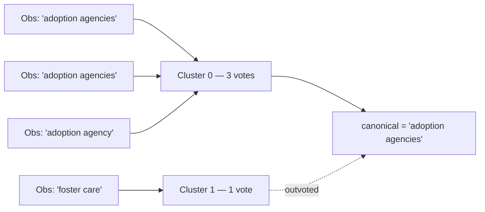
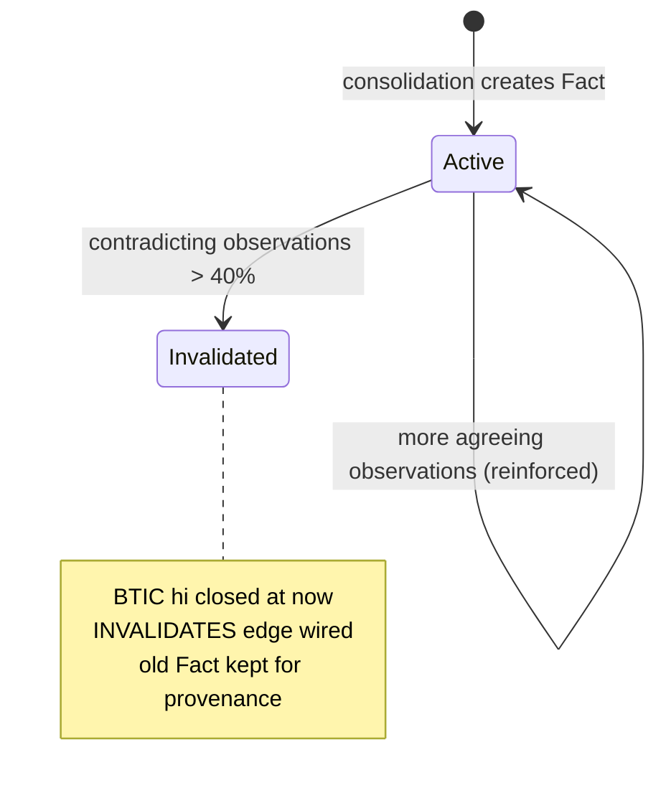
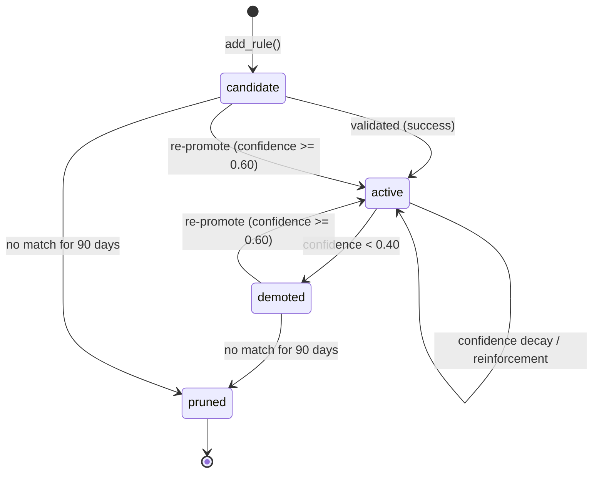
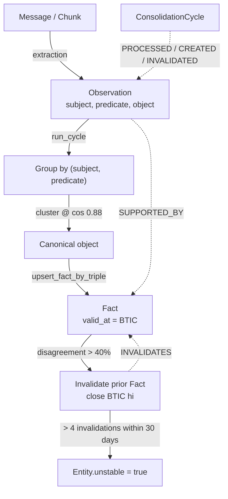

# Facts & Drift

An agent's memory is only useful if it can tell the difference between *what
someone said once* and *what is reliably true*. A single message —
"Caroline is looking at adoption agencies" — is a perception. The same claim
echoed across five sessions is something stronger: a consolidated belief that
can be recalled, reasoned over, and, crucially, *revised* when the world
changes.

uniko draws that line explicitly. Raw perceptions land as **Observations**.
A background consolidation cycle collapses repeated, paraphrased Observations
into durable **Facts**, each stamped with a bitemporal validity interval. When
later evidence contradicts an existing Fact, consolidation closes that Fact's
interval and wires an `INVALIDATES` edge — the old belief is not deleted, it is
*retired with provenance*. Repeated retirements against the same subject mark
the **Entity** as unstable, and the formal **Rules** that drive reasoning decay
in confidence when they stop earning their keep.

This page walks the lifecycle: Observation → Fact consolidation, the BTIC
temporal model, contradiction detection and the active → invalidated lifecycle,
and the two decay signals — Entity drift and Rule confidence decay.

!!! note "Where this runs"
    Consolidation lives in `uniko-memory`'s `consolidation.rs`. It is a
    library cycle you drive over a [`KnowledgeBase`](architecture.md);
    there is no separate service to stand up.

---

## From Observation to Fact

An **Observation** is a direct statement perceived from a Message or Chunk —
"Caroline attended an LGBTQ support group." It is not derived knowledge; it is
*what was said*, tagged with a `subject`, a `predicate`, an `object`, and an
`observed_at` real-world timestamp.

A **Fact** is what consolidation distils out of many Observations that agree:

> "Caroline is pursuing adoption" — derived from observations across sessions 2,
> 5, 13, 17, 19.

A consolidation cycle (`run_cycle` / `run_cycle_with`) does five things:

1. **Query** unprocessed Observations that carry a structured triple
   (`subject` and `predicate` both non-null).
2. **Group** them by `(subject, predicate)` and pick a canonical `object` per
   group.
3. **Upsert** one Fact per group, reusing the first contributing Observation's
   embedding as the Fact's embedding source.
4. **Wire** a `SUPPORTED_BY` edge from every contributing Observation to its
   Fact, so the Fact's evidence is always traceable.
5. **Record** a `ConsolidationCycle` audit node with `PROCESSED`, `CREATED`,
   and `INVOLVED` edges. The `PROCESSED` edges are the idempotency anchor —
   future cycles skip any Observation already processed.

```rust
use uniko_memory::consolidation::{run_cycle, CycleStats};
use uniko_store::KnowledgeBase;

// One sweep for an agent; `None` uses the default batch size (500).
let stats: CycleStats = run_cycle(&kb, "agent-locomo", None).await?;

println!(
    "processed {} observations → {} facts created, {} reinforced, \
     {} invalidated, {} drift alerts",
    stats.observations_processed,
    stats.facts_created,
    stats.facts_reinforced,
    stats.facts_invalidated,
    stats.drift_alerts,
);
```

`CycleStats` is the cycle's ledger: `observations_processed`, `facts_created`,
`facts_reinforced` (an existing Fact whose `observation_count` grew),
`facts_invalidated`, and `drift_alerts`.

!!! tip "Idempotent by construction"
    Because the query excludes Observations already wired by a prior cycle's
    `PROCESSED` edge, you can call `run_cycle` as often as you like. Each
    `(Fact, Observation)` pair gets exactly one `SUPPORTED_BY` edge.

### Where triples come from

By default consolidation trusts the `(subject, predicate, object)` triple that
extraction already stored on the Observation node — the `SrlDep` source, with
no LLM dependency. A cycle can instead refine each Observation's triple with a
language model before grouping, which yields cleaner predicates (e.g. "got" /
"got_a" / "received" all collapsing to "received"):

=== "Default — SRL/DEP triples"

    ```rust
    use uniko_memory::consolidation::{run_cycle_with, TripleSource};

    let stats = run_cycle_with(&kb, "agent", None, &TripleSource::SrlDep).await?;
    ```

=== "LLM-refined triples"

    ```rust
    use uniko_memory::consolidation::{run_cycle_with, TripleSource};

    let source = TripleSource::Llm { alias: "triple-extractor".into() };
    let stats = run_cycle_with(&kb, "agent", None, &source).await?;
    ```

The LLM path costs one model call per Observation per cycle and falls back to
the SRL/DEP triple whenever the model declines or its response fails to parse.

---

## Paraphrase collapse: clustering before the vote

The hard part of picking a canonical `object` is that natural language says the
same thing many ways. "adoption agencies" and "adoption agency" are the same
claim; if you mode-vote over raw strings they split into separate buckets and an
off-topic recency-winner can sneak in as canonical.

So consolidation clusters object surface forms by **cosine similarity over their
document embeddings** before voting. Two surface forms at or above a cosine
similarity of **0.88** are treated as paraphrases of one canonical claim:

```rust
/// Cosine similarity at or above which two object surface forms are
/// treated as paraphrases of the same canonical claim.
const COSINE_THRESHOLD: f32 = 0.88;
```

The threshold is tuned for BGE-small-en (the bench default): exact paraphrases
land in the 0.93+ range, while genuinely different objects ("Rust" vs "Go") sit
well below 0.7 — so 0.88 collapses inflection and article variation without
merging distinct entities. Clustering is single-pass greedy agglomeration with
running-mean centroids, iterated in sorted key order so cluster assignments are
stable across runs.

The canonical object is then a **mode over clusters** (not raw strings): the
cluster with the most votes wins, the most frequent surface form within that
cluster wins, and ties break by the most recent `observed_at`.



!!! note "Graceful degradation"
    If clustering is disabled, or the batch embedding call fails, each
    normalized string becomes its own singleton cluster — reproducing exact
    string-match mode/recency behaviour. Facts whose embedding can't be
    computed are still stored, just without a vector.

---

## The bitemporal model (BTIC)

Every Fact carries a single `valid_at` property of type **BTIC** — a half-open
validity interval `[lo, hi)` with **per-bound certainty and granularity**. This
is what makes a Fact a *temporal* belief rather than a flat key-value pair.

"Bitemporal" here means uniko tracks two independent time axes:

- **Valid time** — when the claim was true *in the world*, captured by the BTIC
  interval's `lo`/`hi` bounds.
- **Transaction time** — when uniko *knew* it, captured automatically by
  uni-db's `_created_at` / `_updated_at`.

That separation lets you answer "what did we believe last week about what was
true in January?" — the question that flat timestamps can't express.

| Fact state | `valid_at` | Meaning |
|---|---|---|
| Active | `[2023-05-25, ∞)` | true since the evidence began, still true |
| Invalidated | `[2023-05-25, 2023-10-15)` | was true during this window only |

Two pieces of per-bound metadata travel with the interval:

- **Certainty** — `approximate` when fewer than 10 supporting observations,
  `definite` at 10 or more.
- **Granularity** — per-bound resolution (day, month, year, …), so
  "sometime in 2022" and "on 7 May 2023" are both representable without lying
  about precision.

Because BTIC is one atomic property — not a split `valid_from` / `valid_until`
pair — there is nothing to keep in sync, and Allen's interval algebra
(`btic.overlaps()`, `btic.before()`, `btic.during()`) is available for temporal
reasoning. Querying "what was true on a given date" is a containment check:

```cypher
-- "What is true now?"
MATCH (f:Fact) WHERE btic.contains(f.valid_at, now())

-- "What was true on March 15?"
MATCH (f:Fact) WHERE btic.contains(f.valid_at, datetime('2026-03-15'))
```

---

## Contradiction detection and the Fact lifecycle

A Fact is not immutable. When the world changes — "Actually I switched to
VSCode last month" — consolidation must retire the stale belief without
destroying the audit trail. This is **F38 contradiction detection**.

Within a `(subject, predicate)` group, consolidation tallies votes *in cluster
space*: how many contributing Observations agree with a prior open Fact's object
(fall in the same cluster) versus how many disagree. If the disagreeing fraction
exceeds the contradiction threshold, the prior Fact is invalidated:

```rust
/// Fraction of observations within a `(subject, predicate)` group that
/// must disagree with the canonical object to trigger F38 invalidation
/// of any prior open-BTIC Facts for the same pair.
const CONTRADICTION_THRESHOLD: f64 = 0.40;
```

"Different" is judged in cluster space, not raw-string space — so a
paraphrase-only change ("agencies" → "agency") never triggers a spurious
invalidation, while a genuine switch ("Vim" → "VSCode") does.

When the threshold is crossed, `invalidate_fact` runs the retirement:

- The prior Fact's BTIC `hi` bound is **closed** at invalidation time — its
  interval changes from `[lo, ∞)` to `[lo, now)`.
- An `INVALIDATES` edge is wired from the new Fact to the retired one, carrying
  a `reason` (here, `"consolidation contradiction"`).



!!! warning "Retired, not deleted"
    Invalidation closes the interval and records why — it never removes the
    node. A bitemporal query as of an earlier date still sees the old Fact as
    true. This is how uniko answers "what did we believe before the update?"

### Lifecycle history

Earlier in uniko's build, contradiction detection was a deferred concern: the
extraction-side `contradiction.rs` returned an empty vector because low
embedding similarity does not imply contradiction. The grounded comparison the
team used:

| Pair | Similarity | Relationship |
|---|---|---|
| "Caroline works at hospital" vs. "Caroline likes jazz" | Low | Unrelated (not a contradiction) |
| "Caroline works at hospital" vs. "Caroline works night shifts" | Moderate | Compatible (not a contradiction) |
| "Caroline works at hospital" vs. "Caroline works at law firm" | Moderate-high | Real contradiction (same predicate slot, different value) |

The lesson — that a real contradiction needs *same subject, same predicate slot,
different object* — is exactly why contradiction detection lives in
consolidation, where the structured triple is available, rather than in
embedding-similarity space.

---

## Entity drift: when a subject gets unstable

A single retired Fact is normal. A *subject whose Facts keep getting retired* is
a signal that something about that Entity is genuinely in flux — and that recall
should be more careful about it. This is **F39 entity drift**.

Every invalidation increments the subject Entity's `invalidation_count`, but the
`unstable` flag is **windowed**: `record_entity_invalidation` counts only the
`INVALIDATES` edges from the last 30 days (`DRIFT_WINDOW_DAYS = 30`) and flips
`Entity.unstable = true` when that windowed count exceeds the drift threshold —
more than 4 invalidations within 30 days. The cumulative `invalidation_count` is
still incremented, but the flag is gated on the 30-day window, not the lifetime
total:

```rust
/// Windowed invalidation count above which an Entity is flagged
/// `unstable = true` (F39); counted over the last DRIFT_WINDOW_DAYS = 30 days.
const DRIFT_THRESHOLD: i64 = 4;
```

When `Entity.unstable` flips to `true`, the cycle increments `drift_alerts` in
its `CycleStats`. The flag is consumed by the recall cascade's **F58 drift
override** (`recall/mod.rs`, `kb.any_unstable_entities`): a query that references
an unstable Entity is forced past the cheap, indexed Phase 1 into Phase 2+
expansion, so it doesn't answer from a belief that's actively churning.

---

## Decay: confidence fades with disuse

Drift handles knowledge that *changed*. Decay handles knowledge that *stopped
being used*. The formal **Rules** that drive reasoning carry a `confidence`
score, and confidence decays exponentially with every consolidation cycle a Rule
fails to match:

```text
confidence' = confidence * 0.95^missed_cycles
```

A cycle is "missed" when the Rule binds no matches during that pass; recording a
match resets `missed_cycles` to zero, applies a `+0.05` confidence boost (capped
at 1.0), and can flip a `candidate` or `demoted` Rule back to `active` once
confidence clears the re-promote threshold. The decay drives a confidence state
machine:



The thresholds (`RuleLifecycleConfig`) default to: `decay_per_cycle = 0.95`,
`demote_threshold = 0.40`, `repromote_threshold = 0.60`, and pruning after 90
days without a match. The gap between demote (0.40) and re-promote (0.60) is
deliberate hysteresis, so a Rule near the boundary doesn't flap. Stdlib Rules
(`source_type = "stdlib"`) are exempt from decay, demotion, and pruning.

!!! note "Procedures track effectiveness too"
    A **Procedure** carries `effectiveness`, `use_count`, `success_count`,
    `failure_count`, and a `last_used_at` timestamp, with a `candidate → active
    → deprecated` status field — the same disuse-aware shape. The live
    confidence-decay loop described above ships for Rules.

---

## Putting it together



Every step is traceable: a Fact links back through `SUPPORTED_BY` to its
Observations, every invalidation is wired with an `INVALIDATES` edge and a
reason, and the `ConsolidationCycle` node answers "why does this Fact exist, and
what happened in the last cycle?"

## Related

<div class="feature-grid">
<div class="feature-card">
### [Architecture](architecture.md)
How consolidation fits the `KnowledgeBase` and the memory layers.
</div>
<div class="feature-card">
### [Data Model](data-model.md)
Full node and edge definitions for Observation, Fact, Entity, and Rule.
</div>
</div>
