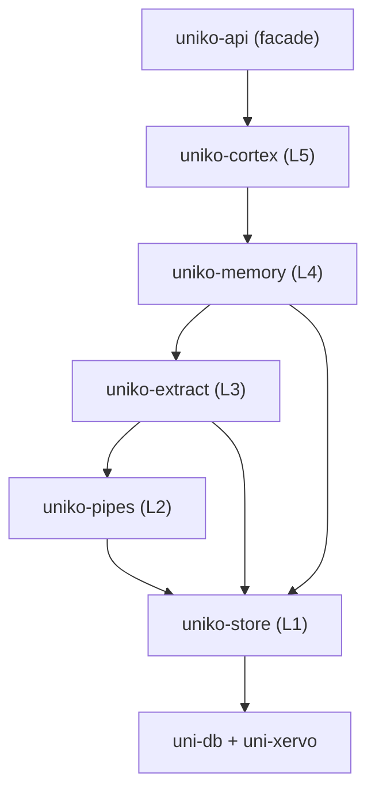

# Installation

uniko is an embedded, Rust-native cognitive memory system. There is no
server to deploy and no daemon to run — you add a crate to your `Cargo.toml`,
open a [`KnowledgeBase`](../concepts/architecture.md), and the whole memory
system lives in your process. Storage, vector and hybrid search, NLP
extraction, and the recall cascade all run in-process, backed by the embedded
[uni-db](https://github.com/rustic-ai/uni-db) graph database and the
uni-xervo model runtime.

This page covers how to depend on the uniko crates, the Cargo feature flags
that matter, the models that load at runtime, and the system prerequisites
they imply.

!!! note "Rust library, layered crates"
    uniko ships as a small set of layered crates in a Cargo workspace. You
    pick the layer you need — most applications depend on `uniko-api` (the
    public facade) or one of the product crates directly.

## The crates

uniko is organized as a strict layer stack. Each crate depends only on the
ones below it, and the graph database (`uni-db`) is sealed behind the bottom
layer so higher crates never touch it directly.

| Crate | Layer | Responsibility |
|-------|-------|----------------|
| `uniko-store` | 1 | Graph storage, search (vector / fulltext / hybrid), and the Locy runtime. Wraps uni-db. |
| `uniko-pipes` | 2 | Pipeline infrastructure — the `Step` trait, circuit breaker, retry, DLQ, metrics. |
| `uniko-extract` | 3 | Content processing — NER, observations, chunking, ingest, embedding. |
| `uniko-memory` | 4 | Memory management — pipelines, the recall cascade, rules, consolidation. |
| `uniko-cortex` | 5 | Higher reasoning — procedures, topics, planning. |
| `uniko-api` | facade | Public facade: builders and re-exports, no logic of its own. |



!!! tip "Which crate do I add?"
    If you just want to record and recall memories, depend on `uniko-api` (or
    `uniko-memory`). If you only need the typed graph store, vector search, and
    Locy runtime, `uniko-store` alone is enough.

## Adding the dependency

uniko lives in a Cargo workspace and is not yet published to crates.io. Add
the crates you need either as path or git dependencies. The workspace uses
`edition = "2024"`, so your consuming crate needs a toolchain that supports it.

=== "Path dependency"

    ```toml
    # Cargo.toml
    [dependencies]
    uniko-api = { path = "../uniko/crates/uniko-api" }
    # ...or depend on a specific layer directly:
    uniko-memory = { path = "../uniko/crates/uniko-memory" }
    uniko-store  = { path = "../uniko/crates/uniko-store" }
    ```

=== "Git dependency"

    ```toml
    # Cargo.toml
    [dependencies]
    uniko-api = { git = "https://github.com/rustic-ai/uniko" }
    ```

Opening a knowledge base is the entry point. Everything else hangs off the
`KnowledgeBase` handle:

```rust
use uniko_store::{KnowledgeBase, config::UnikoConfig};

# async fn demo() -> uniko_store::Result<()> {
// Persistent KB on disk. Registers the schema (idempotent) and
// eagerly warms the embedding / NLP models.
let kb = KnowledgeBase::open("./memory.db", UnikoConfig::default()).await?;

// Or an ephemeral in-memory KB, e.g. for tests:
let kb = KnowledgeBase::in_memory(UnikoConfig::default()).await?;
# Ok(())
# }
```

!!! note "Sharing one model runtime across knowledge bases"
    If you open many knowledge bases in one process, you don't want each one
    to load its own ONNX sessions. Build a shared runtime once with
    `KnowledgeBase::build_shared_runtime` and hand it to each
    `KnowledgeBase::open_with_runtime` call so the model weights and
    activation arenas stay resident exactly once.

## Cargo feature flags

The defaults are tuned for a CPU-only build. The flags below let you turn on
optional content-processing paths and hardware acceleration.

### `uniko-extract`

```toml
[dependencies]
uniko-extract = { path = "../uniko/crates/uniko-extract", features = ["onnx"] }
```

| Feature | Default | Effect |
|---------|---------|--------|
| `code-parse` | **on** | Tree-sitter parsers (Python, Rust, JavaScript, TypeScript) for structure-aware code chunking. |
| `onnx` | off | Pulls in `ort` (ONNX Runtime), `tokenizers`, and `ndarray` for the local ONNX inference path. |

### `uniko-memory`

| Feature | Default | Effect |
|---------|---------|--------|
| `onnx` | off | Forwards to `uniko-extract/onnx`. |
| `llm` | off | Enables the abstractive (LLM-rewritten) path for session Summary generation. When absent, summary generation stays **deterministic / extractive and fully offline**. |

### `uniko-store`

| Feature | Default | Effect |
|---------|---------|--------|
| `gpu-cuda` | off | Enables NVIDIA CUDA acceleration in uni-db. Requires the CUDA toolkit at build time. |
| `gpu-metal` | off | Enables Apple Metal / CoreML acceleration in uni-db (macOS only). |
| `batch-record` | off | Diagnostic-only: captures bulk-write batches in a process-global buffer so benchmarks can replay them. Never enable in production. |

!!! warning "GPU features are build-time"
    `gpu-cuda` and `gpu-metal` are passthrough features that flip the
    corresponding uni-db features. They require the matching toolchain present
    when you compile (CUDA toolkit for `gpu-cuda`). Without them, inference
    runs on CPU via ONNX Runtime.

## Models used at runtime

uniko registers three model *aliases* in the uni-xervo catalog when a
knowledge base opens. Each resolves to a model that uni-xervo loads and runs
in-process. With the default configuration the catalog warms models lazily on
first use; `open` eagerly pre-warms them so the first query doesn't pay
cold-start latency.

| Alias | Task | Default model | Notes |
|-------|------|---------------|-------|
| `embed/default` | Embedding | `BAAI/bge-small-en-v1.5` | 384-dim, BERT-based MTEB-strong retriever. Query side uses the prefix `"Represent this sentence for searching relevant passages: "`; documents go in raw. |
| `nlp/default` | NLP | `dragonscale-ai/kniv-deberta-nlp-base-en-xsmall` | Multi-task cascade loaded from the `onnx/cascade-int8.onnx` (INT8) artifact. xervo owns tokenization and POS / NER / DEP / SRL / CLS decode; uniko adapts the output. |
| `rerank/default` | Rerank | `cross-encoder/ms-marco-MiniLM-L-6-v2` | Cross-encoder reranker, **enabled by default**. 22M params; re-scores the top RRF candidates during recall. |

!!! note "Where these defaults live"
    These values come from `UnikoConfig`'s defaults:
    `EmbeddingConfig::bge_small_en_v15()` (384-dim), the `NlpConfig` defaults
    (`kniv-deberta-nlp-base-en-xsmall` + `onnx/cascade-int8.onnx`), and
    `RerankerConfig::default()` (MS-MARCO MiniLM-L-6-v2, enabled). Every one is
    overridable on `UnikoConfig` before you call `open`.

### Embedding

Embeddings power vector search across every semantically indexed node —
Message, Chunk, Observation, Summary, Entity, Fact, and more. The default
embedder is **BGE-small-en-v1.5** at 384 dimensions. Other presets ship in
`EmbeddingConfig` (e.g. `bge_large_en_v15()` at 1024-dim, `minilm_l6_v2()` at
384-dim) and are selectable by short name via `EmbeddingConfig::preset(...)`.

!!! warning "Index dimension is fixed at open"
    The vector indexes are created for the embedder's dimension. If you switch
    to an embedder with a different dimension (e.g. BGE-large at 1024-dim),
    open a fresh knowledge base — you cannot mix dimensions in one index.

### NLP

NER and observation extraction route through the `nlp/default` alias: a
multi-task **kniv-deberta** cascade running through uni-xervo's `local/onnx`
provider. The default artifact is INT8-quantized (`onnx/cascade-int8.onnx`)
for CPU-feasible inference. SRL (semantic role labelling) is gated by
`UnikoConfig.nlp_srl_enabled`; the remaining tasks (POS, NER, DEP, CLS) always
run. If the runtime or alias is unavailable, extraction falls back to a
rule-based path rather than failing.

### Reranker

The cross-encoder reranker (`rerank/default`) is enabled by default and
re-scores the top recall candidates. It is the cheapest BERT-family option in
the box (MS-MARCO MiniLM-L-6-v2, 22M params); disable it by constructing
`RerankerConfig { enabled: false, ..Default::default() }`.

## System prerequisites

uniko's runtime dependencies are pulled in as crates and built with your
application — there is nothing to install separately for the default CPU
build.

- **ONNX Runtime** — the local inference path (embeddings, NLP, reranker)
  uses `ort` (ONNX Runtime bindings) through uni-xervo. The default `ort`
  configuration downloads/links a prebuilt runtime at build time.
- **Model downloads** — the default embedding, NLP, and reranker models are
  pulled from their model repositories on first use (and pre-warmed on
  `open`). Expect a one-time download on a fresh machine, plus disk for the
  cached weights. Use `KnowledgeBase::open_with_xervo_no_prefetch` for
  read-only tooling that never embeds or generates, to skip the warm-up cost.
- **GPU toolchains** (optional) — only required when building with `gpu-cuda`
  (CUDA toolkit) or `gpu-metal` (macOS / CoreML).

!!! tip "Offline-friendly defaults"
    With the default configuration — BGE-small embeddings, the INT8 NLP
    cascade, the MiniLM reranker, and **no** `llm` feature — everything runs
    locally on CPU with no external API calls. Summary generation stays
    extractive and offline unless you opt into the `llm` feature.

## Next steps

<div class="feature-grid">
<div class="feature-card">
### [Architecture](../concepts/architecture.md)
How the layered crates and the sealed uni-db boundary fit together.
</div>
<div class="feature-card">
### [Quickstart](quickstart.md)
Open a `KnowledgeBase` and record your first memory.
</div>
</div>
