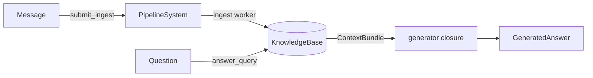

# Quick Start

In one Rust program you will take an empty database to an answered question: ingest a three-turn
conversation, then ask *"What pet does Alice have?"* and get the answer back from compiled
knowledge. The recall path never calls an LLM — the only model call here is the one you make to
phrase the final answer. This is the same flow the benchmark harness runs.

The path is three moves:

1. Open (or create) a [`KnowledgeBase`](../concepts/architecture.md) — the single handle to the
   graph.
2. Start a `PipelineSystem` and submit a few `Message`s — a tiny conversation.
3. Run `answer_query` to recall the relevant context and synthesize an answer.

!!! note "uniko is a Rust library"
    There is no server to launch and no command to run. You add the crates to your
    own binary and call the functions below. Everything here is `async`; the examples
    assume a Tokio runtime.

## The shape of the thing

A `KnowledgeBase` wraps the underlying [uni-db](../concepts/architecture.md) graph
and owns the model runtime (embeddings, reranker, generation). A `PipelineSystem`
sits on top: it owns the worker tasks, bounded channels, and the LLM circuit
breaker, and is the single place you submit ingest work. Reads — recall and answer
synthesis — go directly against the `KnowledgeBase`.



## What success looks like

When you run this, the worker extracts entities and observations off the hot path while your code
stays responsive. The query prints a one-line answer — *"Alice has a rescue greyhound named
Biscuit"* — and the count of recalled items that grounded it. Every item traces back to the message
that produced it.

## A complete example

```rust
use std::sync::Arc;
use std::collections::HashMap;
use std::time::Duration;

use chrono::Utc;

use uniko_store::KnowledgeBase;
use uniko_store::config::UnikoConfig;
use uniko_store::xervo::{GenerationOptions, Message as LlmMessage};

use uniko_memory::PipelineSystem;
use uniko_memory::recall::RecallConfig;
use uniko_memory::{answer_query, GeneratedAnswer};

use uniko_pipes::config::PipelineConfig;
use uniko_pipes::step::Step;
use uniko_pipes::types::{IngestMessage, IngestTask};

#[tokio::main]
async fn main() -> anyhow::Result<()> {
    // 1. Open the knowledge base. `in_memory` is ephemeral; use
    //    `KnowledgeBase::open(path, config)` to persist to disk.
    let kb = Arc::new(KnowledgeBase::in_memory(UnikoConfig::default()).await?);

    // 2. Start the pipeline. The third argument is the ingest step chain;
    //    an empty vec runs the worker's built-in message handling only.
    let ingest_steps: Vec<Box<dyn Step>> = vec![];
    let pipeline = PipelineSystem::new(PipelineConfig::default(), kb.clone(), ingest_steps);

    // 3. Submit a tiny two-turn conversation. Session and Participant nodes
    //    are created on first sight from `session_id` / `sender_id`.
    let turns = [
        ("alice", "I just adopted a rescue greyhound named Biscuit."),
        ("bob", "Nice! How is Biscuit settling in?"),
        ("alice", "Great — she already sleeps on the sofa every afternoon."),
    ];
    for (i, (sender, text)) in turns.iter().enumerate() {
        pipeline.submit_ingest(IngestTask::Message(IngestMessage {
            message_id: format!("m-{i}"),
            content: text.to_string(),
            content_type: "text".to_string(),
            sender_id: sender.to_string(),
            session_id: "session-1".to_string(),
            addressed_to: None,
            timestamp: Utc::now(),
            metadata: HashMap::new(),
        }))?;
    }

    // Ingest is asynchronous: submitting is non-blocking, the worker does the
    // extraction. Give it a moment before we query.
    tokio::time::sleep(Duration::from_millis(500)).await;

    // 4. Ask a question. `answer_query` runs the recall cascade, hands the
    //    ranked ContextBundle to your generator closure, and returns the
    //    answer. We opt out of Episode recording by passing `None`.
    let recall_config = RecallConfig::default();
    let kb_for_gen = kb.clone();

    let outcome = answer_query(
        &kb,
        "What pet does Alice have?",
        &recall_config,
        |bundle, question| async move {
            // Build a prompt from the recalled items.
            let context = bundle
                .items
                .iter()
                .map(|i| i.content.as_str())
                .collect::<Vec<_>>()
                .join("\n");
            let messages = vec![
                LlmMessage::system("Answer using only the provided context."),
                LlmMessage::user(&format!("Context:\n{context}\n\nQuestion: {question}")),
            ];
            let text = kb_for_gen
                .generate("llm/default", &messages, GenerationOptions::default())
                .await?;
            Ok(GeneratedAnswer {
                text,
                input_tokens: None,
                output_tokens: None,
                model: Some("llm/default".into()),
            })
        },
        None,
    )
    .await?;

    println!("answer: {}", outcome.answer.text);
    println!("recalled {} items", outcome.bundle.items.len());

    // 5. Drain the workers cleanly.
    pipeline.shutdown().await.ok();
    Ok(())
}
```

## Step by step

### Open the KnowledgeBase

```rust
let kb = Arc::new(KnowledgeBase::in_memory(UnikoConfig::default()).await?);
```

Opening the knowledge base warms the models so the first query is fast: `KnowledgeBase::in_memory`
registers the full schema (idempotently) and warms the model runtime up front, so the first
recall doesn't stall on cold-start model loading. It then hands back a handle. For a durable
store, swap in
`KnowledgeBase::open(path, config)` — same signature, same return type, backed by a
file. The handle is `Clone` (it is an `Arc` internally), so you share one instance
between the pipeline and your query code by cloning it. The outer `Arc` in the
example is there to satisfy `PipelineSystem::new(_, Arc<KnowledgeBase>, _)`, separate
from `KnowledgeBase`'s own internal `Arc`/`Clone`.

!!! tip "Configuration lives on `UnikoConfig`"
    Recall limits, fusion weights, and the reranker toggle are all fields on
    `UnikoConfig`. `RecallConfig::from_uniko_config(kb.config())` derives a recall
    configuration that honours them, which is what the benchmark uses so a single
    config drives both ingest and query.

### Start the pipeline and ingest

```rust
let pipeline = PipelineSystem::new(PipelineConfig::default(), kb.clone(), vec![]);
pipeline.submit_ingest(IngestTask::Message(/* ... */))?;
```

The pipeline keeps your agent responsive under load: `PipelineSystem::new` spawns
the ingest and consolidation workers and returns immediately — the workers begin their loops
at once. `submit_ingest` is **non-blocking**: it pushes onto a bounded channel and returns
`Err` if the channel is full (backpressure) or the system is shutting down, so your request
path never waits on extraction. The unit you submit is an
`IngestTask` — here `IngestTask::Message(IngestMessage { .. })`.

A few things to notice about `IngestMessage`:

- `session_id` and `sender_id` are the only graph anchors you must provide. The
  ingest worker creates the `Session` and `Participant` on first sight, so you do
  not pre-register them.
- `addressed_to: None` lets uniko infer recipients from the session's participants
  (everyone except the sender).
- `content_type` is a free-form MIME-like tag (`"text"`, `"code"`,
  `"tool_result"`, ...).

!!! warning "Ingest is asynchronous"
    `submit_ingest` returning `Ok` means the task was *queued*, not *processed*. The
    worker runs extraction (entities, Observations, chunking) off the channel. In a
    real service, `pipeline.health()` reports queue drain, backpressure, and circuit
    state — not per-task completion; in a short script, give the worker a moment
    before you query, as the example does.

`IngestTask` also carries `Artifact` and `Pdf` variants for ingesting files and
documents — see [Pipelines](../pipelines/index.md) for those paths and for
building a custom step chain (the `Vec<Box<dyn Step>>` argument).

### Answer a question

```rust
let recall_config = RecallConfig::default();
let outcome = answer_query(&kb, question, &recall_config, generator, None).await?;
```

`answer_query` is the convenience wrapper over the recall cascade. It:

1. Runs `recall(kb, question, recall_config)`, producing a ranked `ContextBundle`.
2. Calls your `generator` closure with `(&ContextBundle, &str)` and awaits the
   `GeneratedAnswer` it returns.
3. Optionally records an `Episode` of the recall+answer pair — controlled by the
   final argument.

The generator is a **closure, not a trait**, because uniko-memory deliberately does
not own LLM selection or prompt construction. You decide which model alias to call
and how to format the context. In the example we call
`kb.generate("llm/default", &messages, GenerationOptions::default())`, which returns
the completion text as a `String`; `"llm/default"` is the generation alias resolved
from the model catalog.

The returned `QueryOutcome` gives you everything: `outcome.answer.text` is the
synthesized answer, and `outcome.bundle` is the full ranked recall set
(`items`, `coverage`, `total_tokens`, `phase1_only`) so you can inspect or log
exactly what backed the answer.

!!! note "Episode recording is opt-in"
    Passing `None` as the last argument skips recording. To capture the
    recall+answer pair as an `Episode` (the signal P5 procedure promotion learns
    from), pass `Some(QueryRecordOptions { participant_id, .. })` — the named
    Participant must already exist. Recording failures are logged and surface as a
    `None` episode id; they never break a user-visible answer.

### Shut down

```rust
pipeline.shutdown().await.ok();
```

`shutdown` consumes the `PipelineSystem` and drains the workers within the
configured timeout. Do this before your process exits so in-flight ingest tasks
finish cleanly.

## Where to go next

<div class="feature-grid" markdown>
<div class="feature-card" markdown>
### [Concepts](../concepts/architecture.md)
The layered architecture, the node types (Message, Observation, Fact, Entity,
Episode, ...), and how memory is organized.
</div>
<div class="feature-card" markdown>
### [Pipelines](../pipelines/index.md)
Custom ingest step chains, artifact and PDF ingestion, consolidation, and the
health/backpressure model.
</div>
<div class="feature-card" markdown>
### [Recall](../pipelines/recall.md)
The phased recall cascade, `RecallConfig` tuning, and the `ContextBundle` your
generator receives.
</div>
</div>
