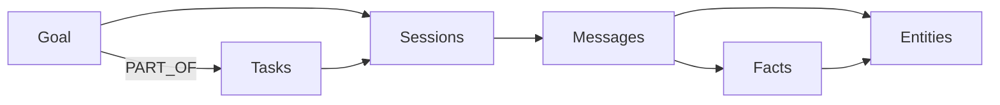

# Agent Tools

uniko splits memory writes into two kinds of work. **Pipelines** handle what can be *inferred* from a
message stream — Observations, Facts, Entities, Topics extracted by the ingest path. **Agent tools**
handle what only the agent can *decide* to record: the goal it is pursuing, the task it broke that
goal into, the action it just ran, the episode it judged worth remembering. No extractor can read
these off a transcript, so the cognitive stack exposes them as explicit calls.

!!! note "Subjective state vs. inferred state"
    If a claim was *said* in a Message, let the ingest pipeline extract it. Reach for an agent tool
    when the agent holds knowledge or intent that was never in the message stream — a goal it set
    itself, a fact it inferred, a correction it must apply now rather than waiting for consolidation.

## Two layers

- **The facade** — goals and tasks are first-class on the [`Agent`](../reference/api.md): reach them
  through `agent.goals()`. This is the surface most callers want.
- **Recording primitives** — facts, observations, episodes, and actions are **free functions** over a
  `KnowledgeBase` (the engine handle the facade wraps). They're for engine-level callers who hold a
  `KnowledgeBase` directly: `tool(&kb, agent_id, params)` (or `(&kb, params)` for `assert_fact` /
  `invalidate_fact`).

```rust
// The facade params for goals and tasks come from `uniko_api::tools`.
use uniko_api::tools::{CreateGoalParams, CreateTaskParams};

// The recording free functions and their params live on the `uniko_memory`
// crate root — `uniko_api::tools` intentionally guards them out and only
// re-exports the facade surface.
use uniko_memory::{
    RecordActionParams, RecordEpisodeParams,
    AddObservationParams, AssertFactParams, InvalidateFactParams,
    create_goal, create_task, record_action, record_episode,
    add_observation, assert_fact, invalidate_fact,
};
```

!!! warning "The Participant must exist first"
    Tools that take an `agent_id` resolve it to a `Participant` node up front and fail fast with
    `UnikoError::Storage` if it is missing. `session.observe(...)` creates the agent's Participant on
    first sight; a pure-planning agent should observe once (or seed the Participant) before recording.

---

## Goals and tasks — `agent.goals()`

A `Goal` is a top-level objective the agent committed to; a `Task` is a concrete unit of work that
advances it. `agent.goals()` covers their full lifecycle — create, transition, read by phase, and
expand a goal's working context.

```rust
use serde_json::json;
use uniko_memory::CreateGoalParams;

let agent = memory.agent("assistant");

// Create — only `title` is required; metrics/guardrails take arbitrary JSON.
let goal = agent.goals().create(CreateGoalParams {
    goal_id: Some("g-billing".into()),
    title: "Migrate billing to the new ledger".into(),
    metrics: Some(json!({ "max_downtime_minutes": 5 })),
    ..Default::default()
}).await?;

// Transition — status defaults to "active"; complete records the result.
agent.goals().start("g-billing").await?;
agent.goals().complete("g-billing", Some(json!({ "downtime_minutes": 2 }))).await?;
```

**Lifecycle phases** are derived from the free-form `status` (+ `completed_at`):
`GoalPhase::{Planned, Active, Completed, Abandoned}`; `TaskPhase::{Planned, Active, Completed,
Blocked}`. Read sliced by phase:

```rust
let active    = agent.goals().active().await?;     // currently pursued
let planned   = agent.goals().planned().await?;    // future work
let completed = agent.goals().completed().await?;  // history + results
let one       = agent.goals().get("g-billing").await?;   // Option<GoalView>
```

Each `GoalView` carries `{ goal_id, title, status, phase, deadline?, completed_at?, metrics? }`;
`metrics` holds the success criteria you set at creation, merged with the result you pass to
`complete`. Transitions return `Result<bool>` — `false` for an unknown id, not an error.

### Tasks under a goal

```rust
use uniko_memory::CreateTaskParams;

agent.goals().create_task(CreateTaskParams {
    title: "Backfill the ledger from the legacy table".into(),
    priority: Some(0.8),
    goal_id: Some("g-billing".into()),  // PART_OF, best-effort
    ..Default::default()
}).await?;

let tasks = agent.goals().tasks_of("g-billing").await?;   // Vec<TaskView>
agent.goals().complete_task("t-1").await?;
```

| Edge | Target | Required | From params |
|------|--------|----------|-------------|
| `ASSIGNED_TO` | Participant | yes | the agent |
| `PART_OF` | Goal | best-effort | `goal_id` |
| `DEPENDS_ON` | Task | best-effort | `depends_on_task_id` |
| `SUBTASK_OF` | Task | best-effort | `subtask_of_task_id` |

### Working context for a goal

`agent.goals().context(goal_id)` answers "what is in front of the agent for this goal right now?" It
expands the goal outward through its Tasks, Sessions, Messages, Facts, and Entities and returns a
typed `GoalContext`. Computed live, it reflects the current graph on every call; an unknown goal
returns `None`.



```rust
if let Some(ctx) = agent.goals().context("g-billing").await? {
    // ctx.goal: GoalView, ctx.tasks: Vec<TaskView>,
    // ctx.sessions / ctx.recent_messages / ctx.facts / ctx.entities: Vec<String>
}
```

!!! tip "Bring your own IDs"
    Every creation call accepts an optional pre-set external key (`goal_id`, `task_id`). Leave it
    `None` and uniko generates a UUID v7; set it to integrate with an external ID space.

---

## Doing: Actions and Episodes

These are engine-level recording primitives — free functions over a `KnowledgeBase`.

### record_action

An `Action` is a concrete tool call — a shell command, file edit, API request, RPC. It carries
input/output payloads and links to the artifacts it produces and the messages that triggered it.
`record_action` wires a mandatory `PERFORMED_BY` edge; optional `TRIGGERED_BY` (Message),
`IN_SESSION` (Session), and `NEXT_ACTION` (previous Action) edges are best-effort. It returns:

```rust
pub struct RecordActionResult {
    pub action_node: NodeId,
    pub overflow_artifact: Option<NodeId>,
}
```

When `output` exceeds `UnikoConfig::action_output_artifact_threshold` (default **256** tokens), the
full payload overflows into an `Artifact` linked by `PRODUCED` and the Action keeps a short stub —
`overflow_artifact` carries that node's id.

```rust
use serde_json::json;
use uniko_memory::{record_action, RecordActionParams};

let result = record_action(&kb, "assistant", RecordActionParams {
    action_type: "shell".into(),
    input: Some(json!({ "cmd": "cargo test --workspace" })),
    output: Some(json!({ "stdout": "…", "exit": 0 })),
    status: Some("success".into()),
    ..Default::default()
}).await?;
```

### record_episode

An `Episode` captures the agent's subjective experience: what it did, the outcome, the state at that
moment. Episodes feed procedure promotion, the relevance-decay rule, and Phase 2 of recall.
`action_type` and `outcome` are the meaningful inputs; `state`/`delta` are free-form JSON. The first
non-empty string at `topic`/`question`/`description`/`summary`/`input` in `state` becomes the
embedding text. `importance` (`[0.0, 1.0]`, default `0.5`) drives decay. The tool wires
`RECORDED_BY`, a `FOLLOWED_BY` edge within the one-hour continuity window, and best-effort `INVOLVES`
edges to `involved_action_ids`.

```rust
use serde_json::json;
use uniko_memory::{record_episode, RecordEpisodeParams};

let episode = record_episode(&kb, "assistant", RecordEpisodeParams {
    action_type: "build".into(),
    outcome: Some("failure".into()),
    state: Some(json!({ "topic": "ledger backfill build", "error": "missing column" })),
    importance: Some(0.7),
    ..Default::default()
}).await?;
```

---

## Asserting knowledge: Observations and Facts

### add_observation

An `Observation` is an atomic claim tied to the Message it was drawn from. The ingest pipeline
extracts these automatically; `add_observation` lets an agent add one explicitly. Because every
Observation is anchored to a Message via `OBSERVED_IN`, it **requires** a `message_id`. `confidence`
defaults to `1.0` (agent-asserted).

```rust
use uniko_memory::{add_observation, AddObservationParams};

let obs = add_observation(&kb, "assistant", AddObservationParams {
    message_id: "m-12".into(),
    content: "Caroline plays clarinet".into(),
    subject: "Caroline".into(),
    predicate: Some("plays".into()),
    object: Some("clarinet".into()),
    ..Default::default()
}).await?;
```

### assert_fact

Most `Fact`s are *derived* by consolidation. `assert_fact` lets an agent assert one directly. The
triple `(subject, predicate, object)` is the Fact's identity — asserting the same triple reinforces
rather than duplicates. Returns a `FactUpsert` (was it new, current observation count).

```rust
use uniko_memory::{assert_fact, AssertFactParams};

let upsert = assert_fact(&kb, AssertFactParams {
    subject: "user".into(),
    predicate: "prefers".into(),
    object: Some("dark mode".into()),
    ..Default::default()
}).await?;
```

### invalidate_fact

`invalidate_fact` retracts a Fact by closing its bitemporal validity interval at `now` — the Fact is
not deleted, it stops being valid. When `replacement_fact_id` resolves, the supersession is recorded
via an `INVALIDATES` edge carrying the optional `reason`.

```rust
use uniko_memory::{invalidate_fact, InvalidateFactParams};

invalidate_fact(&kb, InvalidateFactParams {
    fact_id: "f-darkmode".into(),
    replacement_fact_id: Some("f-lightmode".into()),
    reason: Some("user switched to light mode".into()),
    ..Default::default()
}).await?;
```

!!! note "Bitemporal, not destructive"
    Assertion routes through `upsert_fact_by_triple` (idempotent on the triple); retraction closes
    the bitemporal interval. History is preserved.

---

## Answering and summarizing

### agent.answer — the easy path

`agent.answer(question)` runs recall, calls the LLM you configured with `.llm(...)`, and returns an
[`Answer`](../reference/api.md#answer) with the grounding context and `citations()`. No closure, no
prompt plumbing.

```rust
let ans = agent.answer("Which ledger did billing migrate to?").await?;
println!("{}", ans.text);
for src in ans.citations() { /* what grounded the answer */ }
```

### answer_query — bring your own LLM

When you want to own model selection and prompt construction, the low-level `answer_query` runs
recall, hands the bundle to **your** generator closure (returning a `GeneratedAnswer`), and — when
you opt in with `QueryRecordOptions` — records the query as an Episode that procedure promotion learns
from. It returns the same `Answer`.

```rust
use uniko_memory::{answer_query, GeneratedAnswer, QueryRecordOptions};

let answer = answer_query(
    &kb,
    "Which ledger did billing migrate to?",
    &recall_config,
    |bundle, question| async move {
        let text = my_llm_call(bundle, question).await?;
        Ok(GeneratedAnswer { text, input_tokens: None, output_tokens: None, model: Some("gpt-4o-mini".into()) })
    },
    Some(QueryRecordOptions { participant_id: "assistant".into(), outcome: Some("success".into()), ..Default::default() }),
).await?;

// answer.text — the synthesized answer
// answer.context — the recall bundle that grounded it
// answer.recorded_episode — Some(id) when recording succeeded
```

!!! note "Recording is opt-in and never blocks the answer"
    Pass `None` to skip recording. A recording failure is logged at debug and surfaces as
    `recorded_episode = None` — it never breaks the user-visible answer.

### session.summarize

A `Summary` is a compact, embedded synopsis of a Session that Phase-3 recall falls back to when
finer-grained Observations and Facts under-cover a query. `session.summarize()` builds or refreshes
it — extractive and deterministic by default (offline, no model), abstractive when an LLM is
configured. Idempotent on a stable id; returns `None` when there's nothing to summarize. (The
free-function form, `generate_session_summary(&kb, session_id, now, llm_alias)`, is available
engine-side.)

```rust
let summary_id = session.summarize().await?;   // Option<NodeId>
```

---

## See also

<div class="feature-grid" markdown>
<div class="feature-card" markdown>
### [API Reference](../reference/api.md)
Full signatures for `agent.goals()`, the recording primitives, and their params structs.
</div>
<div class="feature-card" markdown>
### [Recall & Retrieval](retrieval.md)
`recall`/`answer`, item provenance, and dereferencing sources with `agent.data()`.
</div>
</div>
