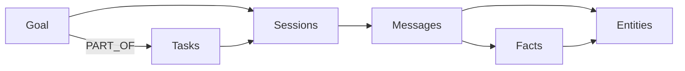

# Agent Tools

uniko splits memory writes into two kinds of work. **Pipelines** handle what can be
*inferred* from a message stream — Observations, Facts, Entities, Topics extracted by the
ingest path. **Agent tools** handle what only the agent can *decide* to record: the goal it
is pursuing, the task it broke that goal into, the action it just ran, the episode it judged
worth remembering. No extractor can read these off a transcript, so the cognitive stack
exposes them as explicit calls.

These tools are plain Rust functions. They are **not** an HTTP endpoint, an MCP surface, or a
command-line tool — you link `uniko-api` (or `uniko-memory` directly) and call them in
process. *Most* tools take a `&KnowledgeBase`, the agent's `participant_id`, and a typed params
struct; the exceptions are `assert_fact`, `invalidate_fact`, and `working_memory`, which take
only `(&KnowledgeBase, params)` with no `agent_id`. Return types vary by tool — `NodeId`,
`RecordActionResult`, `FactUpsert`, `Option<NodeId>` / `()`, or a `ContextBundle`.

!!! note "Subjective state vs. inferred state"
    If a claim was *said* in a Message, let the ingest pipeline extract it. Reach for an agent
    tool when the agent holds knowledge or intent that was never in the message stream — a
    goal it set itself, a fact it inferred, a correction it must apply now rather than waiting
    for consolidation.

## Two surfaces over the same functions

Most tools are a free function of the shape `tool(&KnowledgeBase, agent_id, params)` — the
exceptions `assert_fact`, `invalidate_fact`, and `working_memory` drop the `agent_id` and take
only `(&KnowledgeBase, params)`. That is the right shape for the library core, but a caller
driving a single agent would repeat `kb` and `agent_id` on every call. The [`Agent`](../reference/api.md) facade binds both once and
exposes the same tools as methods — the free functions remain the implementation, so the two
surfaces never diverge.

=== "Free functions"

    ```rust
    use uniko_memory::{create_goal, CreateGoalParams};

    let goal = create_goal(
        &kb,
        "assistant-1",
        CreateGoalParams {
            title: "Ship the release".into(),
            ..Default::default()
        },
    )
    .await?;
    ```

=== "Agent facade"

    ```rust
    use uniko_memory::{Agent, CreateGoalParams};

    let agent = Agent::new(kb, "assistant-1");
    let goal = agent
        .create_goal(CreateGoalParams {
            title: "Ship the release".into(),
            ..Default::default()
        })
        .await?;
    ```

!!! warning "The Participant must exist first"
    Tools that take an `agent_id` resolve it to a `Participant` node up front and fail fast
    with `UnikoError::Storage` if it is missing. Create the agent's Participant once at
    bootstrap before recording anything against it.

The whole set is re-exported through `uniko_api::tools` for downstream consumers:

```rust
use uniko_api::tools::{
    Agent, CreateGoalParams, CreateTaskParams, RecordActionParams, RecordEpisodeParams,
    AddObservationParams, AssertFactParams, InvalidateFactParams, WorkingMemoryParams,
    create_goal, create_task, record_action, record_episode,
    add_observation, assert_fact, invalidate_fact, generate_session_summary,
};
```

---

## Intent: Goals and Tasks

A `Goal` is a top-level objective the agent committed to; a `Task` is a concrete unit of work
that advances it. Both are explicit subjective commitments — the spec classifies them as tools
rather than pipelines because only the agent knows what it is trying to achieve.

### create_goal

`create_goal` merges a `Goal` node, wires a mandatory `OWNED_BY` edge to the agent's
Participant, and embeds the `title` plus `description` so working-memory recall can surface
the active goal alongside relevant context. Only `title` is required; `metrics` and
`guardrails` accept arbitrary JSON stored verbatim. When `parent_goal_id` resolves, a
`PARENT_GOAL` edge is created for sub-goal hierarchies. Status defaults to `"active"`.

```rust
use serde_json::json;
use uniko_memory::{create_goal, CreateGoalParams};

let goal = create_goal(
    &kb,
    "assistant-1",
    CreateGoalParams {
        title: "Migrate billing to the new ledger".into(),
        description: Some("Cut over without dropping in-flight invoices".into()),
        metrics: Some(json!({ "max_downtime_minutes": 5 })),
        guardrails: Some(json!({ "no_schema_change_after": "2026-07-01" })),
        ..Default::default()
    },
)
.await?;
```

!!! tip "Bring your own IDs"
    Every creation tool accepts an optional pre-set external key (`goal_id`, `task_id`,
    `action_id`, `episode_id`). Leave it `None` and uniko generates a UUID v7; set it to
    integrate with an external ID space.

### create_task

`create_task` merges a `Task` node and wires a mandatory `ASSIGNED_TO` edge to the agent's
Participant. Optional links resolve gracefully: a missing `goal_id`, `depends_on_task_id`, or
`subtask_of_task_id` is logged and skipped instead of failing the call, so bulk task creation
never blocks on dependency ordering. Status defaults to `"todo"`; `priority` is a `[0.0, 1.0]`
urgency used later when working memory ranks tasks.

```rust
use uniko_memory::{create_task, CreateTaskParams};

let task = create_task(
    &kb,
    "assistant-1",
    CreateTaskParams {
        title: "Backfill the ledger from the legacy table".into(),
        priority: Some(0.8),
        goal_id: Some(goal_external_id.clone()), // PART_OF, best-effort
        ..Default::default()
    },
)
.await?;
```

| Edge | Target | Required | From params |
|------|--------|----------|-------------|
| `ASSIGNED_TO` | Participant | yes | `agent_id` |
| `PART_OF` | Goal | best-effort | `goal_id` |
| `DEPENDS_ON` | Task | best-effort | `depends_on_task_id` |
| `SUBTASK_OF` | Task | best-effort | `subtask_of_task_id` |

---

## Doing: Actions and Episodes

### record_action

An `Action` is a concrete tool call — a shell command, file edit, API request, RPC. Unlike an
Episode (a subjective learning experience), an Action carries input/output payloads and links
to the artifacts it produces and the messages that triggered it. Only `action_type` is
required.

`record_action` wires a mandatory `PERFORMED_BY` edge to the Participant; the optional
`TRIGGERED_BY` (Message), `IN_SESSION` (Session), and `NEXT_ACTION` (previous Action) edges
are best-effort. It returns a `RecordActionResult`:

```rust
pub struct RecordActionResult {
    pub action_node: NodeId,
    pub overflow_artifact: Option<NodeId>,
}
```

When the `output` exceeds the configured token threshold
(`UnikoConfig::action_output_artifact_threshold`, default **256** tokens), the full payload
overflows into an `Artifact` node linked by `PRODUCED`, and the Action stores a short stub
instead — keeping the hot path small while preserving searchable content in the Artifact's
indexes. The `overflow_artifact` field carries that node's id when it happened.

```rust
use serde_json::json;
use uniko_memory::{record_action, RecordActionParams};

let result = record_action(
    &kb,
    "assistant-1",
    RecordActionParams {
        action_type: "shell".into(),
        input: Some(json!({ "cmd": "cargo test --workspace" })),
        output: Some(json!({ "stdout": "…", "exit": 0 })),
        status: Some("success".into()),
        session_id: Some(session_external_id.clone()),
        ..Default::default()
    },
)
.await?;

if let Some(artifact) = result.overflow_artifact {
    // large output was externalised to an Artifact node
}
```

### record_episode

An `Episode` captures the agent's subjective experience: what it did, the outcome, the state
at that moment, and how state changed. Episodes feed procedure promotion, the relevance-decay
rule, and Phase 2 of the recall cascade. `record_episode` is a tool — not a pipeline —
*because the agent decides what's worth recording.*

`action_type` and `outcome` are the meaningful inputs; `state` and `delta` are free-form JSON.
The first non-empty string at `topic`, `question`, `description`, `summary`, or `input` in
`state` becomes the embedding text. `importance` (`[0.0, 1.0]`, default `0.5`) drives decay
and Phase-1 score weighting. The tool wires `RECORDED_BY` to the Participant and, when the
agent's previous episode is within the one-hour continuity window, a `FOLLOWED_BY` edge with
the actual gap. Each resolvable id in `involved_action_ids` also gets a best-effort `INVOLVES`
edge to its Action.

```rust
use serde_json::json;
use uniko_memory::{record_episode, RecordEpisodeParams};

let episode = record_episode(
    &kb,
    "assistant-1",
    RecordEpisodeParams {
        action_type: "build".into(),
        outcome: Some("failure".into()),
        state: Some(json!({
            "topic": "ledger backfill build",
            "error": "missing column `invoice_uid`",
        })),
        importance: Some(0.7),
        involved_action_ids: vec![/* action_ids that produced this */],
        ..Default::default()
    },
)
.await?;
```

---

## Asserting knowledge: Observations and Facts

### add_observation

An `Observation` is an atomic claim tied to the Message it was drawn from. The ingest pipeline
extracts these automatically; `add_observation` lets an agent add one explicitly — for example
an inference it made while reading that the NLP extractor would not surface. Because every
Observation is anchored to a Message via `OBSERVED_IN`, this tool **requires** a `message_id`.
An agent claim with no message context belongs in `assert_fact` instead.

It reuses the pipeline's writer, so the resulting node and its `OBSERVED_IN` / `ABOUT` edges
are identical to pipeline-extracted ones. `confidence` defaults to `1.0` (agent-asserted).

```rust
use uniko_memory::{add_observation, AddObservationParams};

let obs = add_observation(
    &kb,
    "assistant-1",
    AddObservationParams {
        message_id: msg_external_id.clone(),
        content: "Caroline plays clarinet".into(),
        subject: "Caroline".into(),
        predicate: Some("plays".into()),
        object: Some("clarinet".into()),
        ..Default::default()
    },
)
.await?;
```

### assert_fact

Most `Fact`s are *derived* by consolidation from accumulated Observations. `assert_fact` lets
an agent assert one directly — for knowledge it holds that was never stated in a message. The
triple `(subject, predicate, object)` is the Fact's identity: asserting the same triple again
reinforces the existing Fact rather than duplicating it. The tool embeds the triple text and
wires best-effort `SUPPORTED_BY` edges to any `supporting_observation_ids` that resolve.

It returns a `FactUpsert` so the caller can tell whether a new Fact was created and read the
resulting observation count.

```rust
use uniko_memory::{assert_fact, AssertFactParams};

let upsert = assert_fact(
    &kb,
    AssertFactParams {
        subject: "user".into(),
        predicate: "prefers".into(),
        object: Some("dark mode".into()),
        ..Default::default()
    },
)
.await?;
```

### invalidate_fact

`invalidate_fact` retracts a Fact by closing its bitemporal validity interval at `now` — the
Fact is not deleted, it stops being valid. When `replacement_fact_id` resolves, the
supersession is recorded via an `INVALIDATES` edge (carrying the optional `reason`) so drift
detection can window it. A supplied-but-missing replacement is surfaced as an error rather than
silently dropped.

```rust
use uniko_memory::{invalidate_fact, InvalidateFactParams};

invalidate_fact(
    &kb,
    InvalidateFactParams {
        fact_id: stale_fact_id.clone(),
        replacement_fact_id: Some(new_fact_id.clone()),
        reason: Some("user switched to light mode".into()),
        ..Default::default()
    },
)
.await?;
```

!!! note "Bitemporal, not destructive"
    Both tools route through the same machinery the consolidation path uses:
    `upsert_fact_by_triple` for assertion (idempotent on the triple) and the bitemporal
    interval close for retraction. History is preserved.

---

## Reading state: working memory

`working_memory` answers "what is in front of the agent right now for this goal?" It is **not**
a stored node — it is computed live by traversing the graph from a `Goal` outward through its
Tasks, Sessions, Messages, Facts, and Entities. When the goal changes the result recomputes
instantly; when consolidation updates the underlying knowledge, the next call reflects it.



The traversal uses one Cypher query per category, runs them concurrently, ranks items by
per-tier weight times a per-category boost — recency (sessions/messages/entities), confidence
(facts), priority × status (tasks), and status (goals) — dedups, then truncates to fit the
caller's token budget. `WorkingMemoryParams::new` sets the defaults: `budget` `None` (falls
back to `DEFAULT_TOKEN_BUDGET` = **8192** tokens), `include_subgoals` `true` (pulls
descendants via `PARENT_GOAL*`), and `per_tier_limit` **25**.

```rust
use uniko_memory::{working_memory, WorkingMemoryParams};

let bundle = working_memory(
    &kb,
    WorkingMemoryParams {
        budget: Some(4096),
        ..WorkingMemoryParams::new(goal_external_id.clone())
    },
)
.await?;

for item in &bundle.items {
    // item.node_type, item.content, item.score, item.tier
}
```

The result is a `ContextBundle` — the same type the recall cascade returns — so you can feed it
straight into a prompt. An absent goal returns an empty bundle with `coverage = 0.0` rather
than an error, so callers can poll while a goal is being created.

!!! tip "Latency budget"
    Working memory executes in under 200 ms on a warm in-memory store (under 10K nodes per
    label). Lower `per_tier_limit` to reduce candidate-side work; raise it to give the budget
    more material to rank.

---

## Closing the loop: queries, episodes, and summaries

### answer_query and record_query_episode

These two functions turn production query traffic into Episodes that procedure promotion can
learn from. They live in `uniko-memory` (not the API or bench layer) deliberately: Episodes are
the *input* to procedure promotion, so any library-only caller must be able to produce them.

`record_query_episode` is the primitive. Given a question, the answer the caller produced, and
the recall node ids that backed it, it materialises an Episode whose `state` JSON captures the
question, answer, recall coverage, token counts, and answer-model metadata, then delegates to
`record_episode`. Use it when you already own the LLM call.

`answer_query` is the convenience wrapper: it runs recall, hands the bundle to **your**
generator closure, and — when you opt in with `QueryRecordOptions` — records the Episode in one
call. uniko deliberately does not own LLM selection or system prompts; the generator is a
closure returning a `GeneratedAnswer`, so you bring whatever LLM machinery you have.

```rust
use uniko_memory::{answer_query, GeneratedAnswer, QueryRecordOptions};

let outcome = answer_query(
    &kb,
    "Which ledger did billing migrate to?",
    &recall_config,
    |bundle, question| async move {
        // bundle.items is the ranked recall context
        let text = my_llm_call(bundle, question).await?;
        Ok(GeneratedAnswer {
            text,
            input_tokens: None,
            output_tokens: None,
            model: Some("gpt-4o-mini".into()),
        })
    },
    Some(QueryRecordOptions {
        participant_id: "assistant-1".into(),
        outcome: Some("success".into()),
        ..Default::default()
    }),
)
.await?;

// outcome.bundle  — the recall context
// outcome.answer  — the GeneratedAnswer your closure returned
// outcome.episode_id — Some(id) when recording was requested and succeeded
```

!!! note "Recording is opt-in and never blocks the answer"
    Pass `None` for the record argument to skip recording entirely. When you do opt in, a
    recording failure is logged at debug and surfaces as `episode_id = None` — it never breaks
    the user-visible answer.

### generate_session_summary

A `Summary` is a compact, embedded synopsis of a Session that Phase-3 recall falls back to when
finer-grained Observations and Facts under-cover a query. Generation is **extractive and
deterministic by default** — it selects and concatenates the session's strongest claims, so it
works offline with no model. Passing an `llm_alias` (with the `llm` feature built) rewrites
that material abstractively instead.

Summaries are idempotent on a stable `summary_id` derived from the session, so re-summarising
updates the node in place rather than accumulating duplicates. The tool wires `SUMMARIZES` →
the Session and embeds the text so it becomes a Phase-3 retrieval target. It returns `None` when
the session has no summarisable content.

```rust
use chrono::Utc;
use uniko_memory::generate_session_summary;

// Deterministic, offline extractive summary.
let summary = generate_session_summary(
    &kb,
    session_external_id,
    Utc::now(),
    None,
)
.await?;
```

---

## See also

<div class="feature-grid" markdown>
<div class="feature-card" markdown>
### [API Reference](../reference/api.md)
Full signatures for the `Agent` facade, every tool function, and its params struct.
</div>
<div class="feature-card" markdown>
### [Recall](../pipelines/recall.md)
The `ContextBundle` and `RecallTier` model that working memory and `answer_query` build on.
</div>
</div>
