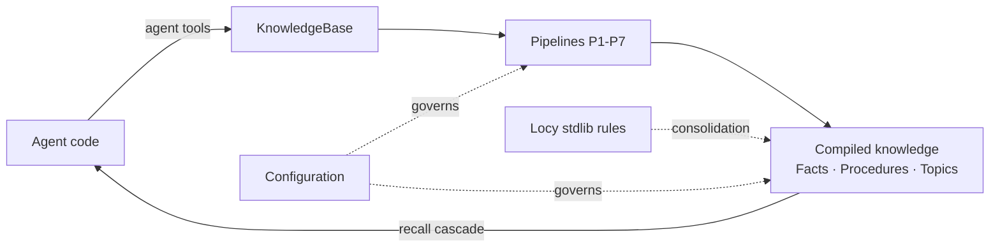

# Guides Overview

The [concepts](../concepts/architecture.md) section explains *how* uniko models memory.
These guides are the practical counterpart: they show how to drive the system from your own
Rust code — recording what an agent did, reasoning over compiled knowledge, and tuning the
behaviour that pipelines automate.

uniko does most of its work without you asking. The ingest pipeline stores Messages, the
NER and observation pipelines extract Entities and Observations, and the consolidation
heartbeat derives Facts, promotes Procedures, and detects Topics in the background. The
guides below cover the parts that remain *yours*: the knowledge only an agent can provide,
the formal reasoning that runs inside the database, and the knobs that govern the
pipelines.

!!! note
    Everything here is a Rust API. uniko links into your process like an embedded library;
    there is no service to operate and no network hop between your agent and its memory.

### [Agent Tools](agent-tools.md)
The supplement to the pipelines — `record_episode`, `record_action`, `add_observation`,
`assert_fact`, `recall`, `working_memory`, and more, for knowledge an agent alone can give.

### [Reasoning with Locy](reasoning-with-locy.md)
The four stdlib rules and database-native logic that turn repeated experience into
Procedures — including which rules are live-invoked and which ship registered but uncalled.

### [Configuration](configuration.md)
The thresholds and cadences that govern ingest, consolidation, the cortex sweep, and the
recall cascade's coverage gates.

## Where the guides fit

**Agent tools** feed the graph the things pipelines cannot infer. Episodes are subjective —
the agent decides what is worth recording — and procedural memory only accumulates when
agents call `record_episode`. The richer the episode stream, the more the system improves
over time.

**Locy reasoning** is what makes consolidation more than aggregation. Four stdlib rules
(`relevance_decay`, `episode_pattern_detector`, `sequence_detector`,
`contradiction_detector`) run every consolidation cycle to detect patterns and promote
Procedures.

!!! note
    Procedure promotion (P5) invokes the `sequence_detector` Locy rule by name via a `QUERY`
    goal-query (RC12 resolved 2026-06-14; the earlier Cypher fallback was removed). The other
    three stdlib rules ship registered as Rule nodes but have no live caller yet. The
    [Reasoning with Locy](reasoning-with-locy.md) guide details where that line falls.

**Configuration** externalises the cadences and thresholds the pipelines use — the cortex
sweep throttles (`cortex_cycle_every_n_consolidations`, `cortex_min_interval_secs`), the
consolidation triggers, and the recall coverage gates. Many retrieval-tuning constants are
still compiled in; the guide is explicit about what is adjustable today.

## Suggested reading order

=== "Building an agent"

    1. [Agent Tools](agent-tools.md) — wire `record_episode` / `record_action` into your
       loop and call `recall` to retrieve.
    2. [Configuration](configuration.md) — set the consolidation and cortex cadences for
       your workload.
    3. [Reasoning with Locy](reasoning-with-locy.md) — understand what the stdlib rules do
       with the episodes you record.

=== "Tuning recall quality"

    1. [Configuration](configuration.md) — the Phase 1 (0.75) and Phase 2 (0.65) coverage
       thresholds and what they gate.
    2. [Agent Tools](agent-tools.md) — `recall` and `working_memory`, the two retrieval
       entry points.

!!! tip
    Procedural learning is opt-in and proportional to episode richness. If
    `phase1_only_pct` is not trending upward, the most common cause is too few recorded
    Episodes — start with [Agent Tools](agent-tools.md).
