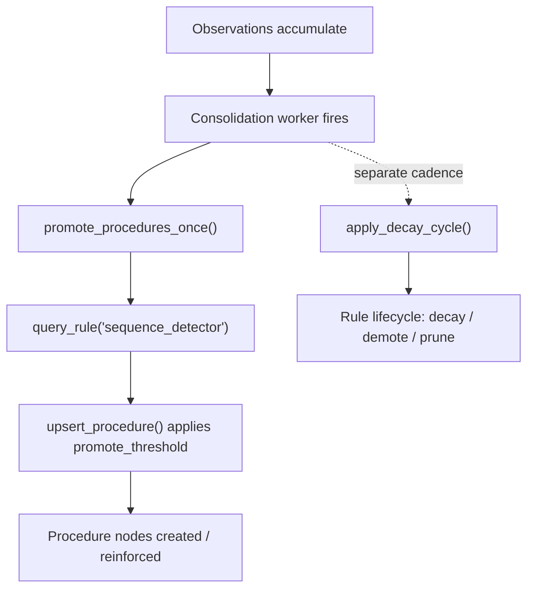

# Reasoning with Locy

Most memory systems can *retrieve* — they hand you back the rows that look like your
query. Far fewer can *reason* — derive a conclusion that was never stored verbatim, decay
old beliefs on a schedule, or ask "what would change if this fact were true?" without
mutating the graph.

uniko reaches for that second tier by embedding **Locy** — uni-db's logic-programming
layer — directly in the graph store. Rules are declarative `CREATE RULE … AS …` programs
that match patterns over your `Episode`, `Fact`, and `Participant` nodes and *yield*
derived bindings. They live in the same graph as your memory, run through the same engine
as your Cypher, and are managed by a confidence-driven lifecycle so a rule that stops
earning its keep eventually decays out.

This guide covers what ships today: the runtime surface in `uniko-store`, the four stdlib
rules in `uniko-memory`, how they participate in consolidation, and — honestly — which of
them actually drive execution versus which are registered-but-not-yet-the-engine.

!!! note "Where the code lives"
    The Locy runtime wrapper is in `uniko-store` (`KnowledgeBase::create_rule`,
    `execute_rule`, `query_rule`, `assume`, `abduce`, …). The stdlib rules and their
    lifecycle state machine are in `uniko-memory` (`rules::stdlib`, `rules::lifecycle`).

## The Locy surface on `KnowledgeBase`

Every Locy capability is a method on [`KnowledgeBase`](../concepts/architecture.md). The
wrapper forwards to uni-db's `db.rules()` registry and the `session().locy_with(program)`
builder — uniko adds parameter threading, error mapping into `UnikoError::Locy`, and
ergonomic result extraction.

| Method | What it does |
|---|---|
| `create_rule(source)` | Register a Locy rule from source (a `CREATE RULE … AS …` statement). |
| `execute_rule(program, params)` | Run an inline Locy *program* and return result rows. |
| `query_rule(name, return_cols, params)` | Invoke a *registered* rule by name via a `QUERY <name> RETURN …` goal query. |
| `list_rules()` | List registered rules as `RuleInfo { name }`. |
| `delete_rule(name)` | Remove a rule from the runtime; returns `true` if it existed. |
| `explain_rule(program)` | Return the `Debug` rendering of runtime stats (developer diagnostic). |
| `assume(block)` | Begin a hypothetical-reasoning `AssumeBuilder`. |
| `abduce(program, params)` | Run an abductive program; collect supporting facts. |

!!! warning "`execute_rule` vs `query_rule`"
    `execute_rule` treats its argument as a Locy **program** — you cannot hand it a bare
    registered rule name, because uni-db parses that as a query and fails. To invoke a
    rule you registered with `create_rule`, use `query_rule`, which builds the
    `QUERY <name> [RETURN <cols>]` goal-query form for you. The `return_cols` must name the
    rule's `YIELD` aliases; result rows are keyed by those names.

A rule is a row-producing query whose body is normal pattern matching plus `FOLD`
aggregation and a `YIELD` projection:

```rust
use std::collections::HashMap;
use uniko_store::{KnowledgeBase, Value};

# async fn example(kb: &KnowledgeBase) -> uniko_store::Result<()> {
// Register a rule once (idempotent — registering an exact duplicate is a no-op).
kb.create_rule(
    "CREATE RULE successful_pairs AS \
     MATCH (e1:Episode)-[:FOLLOWED_BY]->(e2:Episode), \
           (e1)-[:RECORDED_BY]->(p:Participant {participant_id: $agent_id}) \
     WHERE e1.outcome = 'success' AND e2.outcome = 'success' \
     FOLD n = COUNT(*) \
     YIELD KEY e1.action_type AS action_a, KEY e2.action_type AS action_b, \
           n AS success_count",
)
.await?;

// Invoke it by name, naming the YIELD aliases as the columns to return.
let mut params = HashMap::new();
params.insert("agent_id".into(), Value::String("agent-1".into()));
let rows = kb
    .query_rule("successful_pairs", &["action_a", "action_b", "success_count"], &params)
    .await?;
# Ok(())
# }
```

!!! tip "Locy is not Cypher"
    Rule bodies use Locy syntax, which diverges from Cypher in ways that bite if you assume
    they're the same dialect:

    - Multiple relationships go in **one comma-joined `MATCH`** — a second `MATCH` clause is
      a parse error.
    - Aggregate result columns are written `expr AS name` — there is **no `VALUE` keyword**
      in that position.
    - A `$param` inside a post-`FOLD` `HAVING` does **not** resolve; push that filtering to
      the consumer instead.

    These were latent bugs in an earlier `sequence_detector` rule (which is why it never
    registered and a Cypher fallback was load-bearing for a while). They are documented as
    RC12 in the project's uni-db workarounds notes.

## Hypothetical reasoning — `ASSUME`

`assume` forks the graph state, applies mutations from the `ASSUME { … }` block, runs an
optional follow-up query against that hypothetical state, and rolls back — **the original
graph is never modified**. It answers "what would I see if this were true?" without
committing.

```rust
# async fn example(kb: &uniko_store::KnowledgeBase) -> uniko_store::Result<()> {
let rows = kb
    .assume("ASSUME { CREATE (:Fact {subject: 'server', predicate: 'port', object: '9090'}) }")
    .then_query("MATCH (f:Fact {subject: 'server'}) RETURN f")
    .run()
    .await?;
# Ok(())
# }
```

The `AssumeBuilder` chains `then_query(q)` to set the query and `param(key, value)` to
inject parameters; `run()` executes the fork-mutate-query-rollback cycle. The performance
target is under 200 ms (NF9).

## Abductive reasoning — `ABDUCE`

`abduce` runs an abductive Locy program and collects the supporting facts behind a
conclusion into an `AbductionResult`:

```rust
pub struct AbductionResult {
    pub supporting_facts: Vec<(NodeId, HashMap<String, Value>)>,
    pub confidence: f64,
    pub explanation: String,
}
```

!!! warning "Confidence is a placeholder"
    The runtime collects supporting rows correctly, but `confidence` is currently
    hardcoded to `1.0` (an MVP placeholder in `crates/uniko-store/src/locy/abduce.rs`).
    Real scoring — weighting the explanation by support strength and rule-derived priors —
    is not wired yet. Treat `supporting_facts` as the trustworthy output and the
    `confidence`/`explanation` fields as shape-only for now.

The `abduce` module also defines `DerivationTree` / `DerivationNode` types for explaining
how a rule reached a result.

## The stdlib rules

uniko registers **four** stdlib Locy rules. `register_stdlib_rules(&kb)` is idempotent: it
merges a `Rule` node into the graph for each (deterministic `rule_id`, `source_type =
"stdlib"`, `confidence = 1.0`, `status = "active"`) **and** best-effort registers the rule
source in uni-db's Locy runtime. Stdlib rules are protected — `is_stdlib_rule("stdlib")`
returns `true`, and the lifecycle machinery exempts them from decay, demotion, and pruning.

| Rule | Purpose |
|---|---|
| `relevance_decay` | Decay episode relevance with age: `importance * exp(-decay_rate * age_days)`, surfacing episodes still above a threshold. |
| `episode_pattern_detector` | Count episodes by `action_type` + `outcome`; surface patterns with `n >= 3` and mean importance `> 0.3`. |
| `sequence_detector` | Find recurring `(action_a → action_b)` pairs where both episodes succeeded; yield a `success_count`. |
| `contradiction_detector` | Find episodes whose `outcome` contradicts an established `Fact` (`predicate = 'outcome_pattern'`) for fact revision. |

### `relevance_decay`

```text
CREATE RULE relevance_decay AS
MATCH (e:Episode)-[:RECORDED_BY]->(p:Participant {participant_id: $agent_id})
WITH e, duration.inDays(e.timestamp, datetime()) AS age_days,
        e.importance AS base_importance
WITH e, base_importance * exp(-$decay_rate * age_days) AS decayed
WHERE decayed > $decay_threshold
YIELD KEY e, VALUE decayed AS relevance
```

The decay rate comes from a configurable half-life rather than being hand-tuned. Use
`relevance_decay_params(agent_id, half_life_days, decay_threshold)` to build the parameter
map; it converts the half-life with `decay_rate = ln(2) / half_life_days` and packages
`agent_id`, `decay_rate`, and `decay_threshold`. (It panics on a non-positive half-life;
`UnikoConfig::validate` already rejects those upstream.)

```rust
use uniko_memory::rules::relevance_decay_params;

// 14-day half-life: a 14-day-old episode retains half its importance.
let params = relevance_decay_params("agent-1", 14.0, 0.05);
// Pass `params` to `KnowledgeBase::execute_rule`.
```

## How rules participate in consolidation

Consolidation (P4 — see [Consolidation](../pipelines/consolidation.md)) is uniko's
background heartbeat: the worker fires after a batch of observations accumulates or on a
timer. Two rule-driven activities hang off that cycle.



### Procedure promotion runs `sequence_detector`

The consolidation worker calls `promote_procedures_once(&kb, agent_id, cfg)` in
`uniko-cortex`. That function registers `sequence_detector` (idempotent), invokes it via
`query_rule("sequence_detector", &["action_a", "action_b", "success_count"], …)`, and
turns each recurring success pair into a `Procedure` node named `"{a} → {b}"`. The rule
deliberately surfaces **all** pairs with no `HAVING` filter; `upsert_procedure` applies the
`LifecycleConfig::promote_threshold` (default `3`) to decide candidate-vs-active. This is
the one stdlib rule that genuinely drives execution through a real Locy `QUERY` invocation.

### The rule lifecycle decays authored & induced rules

Authored and induced rules (not stdlib ones) move through a confidence-driven state
machine in `uniko-memory::rules::lifecycle`:

```text
add_rule()             validate              decay below 0.40
  │                       │                       │
  ▼                       ▼                       ▼
candidate ──(success)──▶ active ──(repromote ≥ 0.60)──▶ active
                         │                       │
                         └──(no match 90d)──▶ pruned
```

- `add_rule(kb, AddRuleParams { … })` validates the Locy source up front (a syntax error
  leaves **no** `Rule` node behind), then persists a `Rule` in `status = "candidate"` with
  default confidence `0.5`. Passing `source_type = "stdlib"` is rejected — stdlib goes
  through `register_stdlib_rules`.
- `apply_decay_cycle(kb, cfg)` runs once per consolidation cycle: it multiplies each
  non-stdlib rule's confidence by `decay_per_cycle`, bumps `missed_cycles`, and applies the
  state transitions — returning a `DecayReport { decayed, demoted, promoted, pruned }`.
- `record_rule_match(kb, name, cfg)` resets `missed_cycles`, bumps `last_scored_at`, and
  adds a `+0.05` confidence reward (capped at `1.0`) so repeatedly useful rules don't decay
  below the demotion threshold.

The defaults in `RuleLifecycleConfig` match the spec: `decay_per_cycle = 0.95`,
`demote_threshold = 0.40`, `repromote_threshold = 0.60`, `prune_after_days = 90`.

```rust
use uniko_memory::rules::{RuleLifecycleConfig, apply_decay_cycle, record_rule_match};

# async fn example(kb: &uniko_store::KnowledgeBase) -> Result<(), uniko_store::UnikoError> {
let cfg = RuleLifecycleConfig::default();

// A rule that bound matches this cycle gets rewarded and its miss-counter reset.
record_rule_match(kb, "my_authored_rule", cfg).await?;

// Every cycle, decay the rest and harvest the transitions.
let report = apply_decay_cycle(kb, cfg).await?;
println!("demoted={} pruned={}", report.demoted, report.pruned);
# Ok(())
# }
```

When a demoted or never-promoted rule goes `prune_after_days` without a match, it
transitions to the terminal `pruned` status; uniko best-effort removes it from the runtime
but keeps the `Rule` node for provenance.

## Honest status: what's the engine vs what's a node

uniko aims for Locy rules to *be* the reasoning engine. Today that goal is partly realized,
and it's worth being precise about which is which so you don't build on a path that isn't
load-bearing yet:

- **`sequence_detector` is the live engine.** It runs as a registered Locy rule, invoked
  by name via `query_rule` (a `QUERY sequence_detector RETURN …` goal-query) inside
  `promote_procedures_once`, post-consolidation, in `uniko-cortex`. RC12 was resolved
  2026-06-14 and the earlier Cypher fallback (the `sequence_detector` Cypher shim) was
  **removed** — P5 no longer runs through any Cypher-backed path.
- **`relevance_decay` ships as a registered `Rule` node with a parameter builder, but no
  pipeline currently runs it on a cadence.** The rule and its `relevance_decay_params`
  helper exist; the decay-and-prune *driver* that would invoke it per cycle is not yet
  wired, so episodes are not yet decayed/pruned by this rule in production flow.
- **`episode_pattern_detector` is registered but not invoked** anywhere in the live path.
- **`contradiction_detector` is registered, but the contradiction logic that actually runs
  is implemented inline in Rust**, not driven by this rule.

In short: the runtime surface (`create_rule`/`query_rule`/`execute_rule`/`assume`/`abduce`)
is real and the rule *lifecycle* is fully implemented and tested, but only `sequence_detector`
is genuinely the engine today — the other three stdlib rules (`relevance_decay`,
`episode_pattern_detector`, `contradiction_detector`) ship registered as `Rule` nodes but
have no live caller yet, ahead of the pipelines that will eventually call them.

!!! note "Not yet available in rules"
    Locy `EXPLAIN RULE`, `ALONG` / `BEST BY` traversal operators, and `similar_to()` inside
    rule bodies are not available or used in uniko today.

## Related

<div class="feature-grid">
<div class="feature-card">
### [Consolidation](../pipelines/consolidation.md)
The background heartbeat that runs procedure promotion and the rule lifecycle.
</div>
<div class="feature-card">
### [Architecture](../concepts/architecture.md)
Where `KnowledgeBase` and the Locy runtime sit in the crate stack.
</div>
</div>
