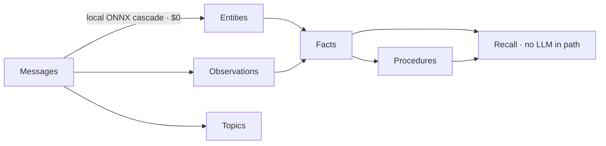

<div class="hero" markdown>

# uniko

## The embedded memory layer for AI agents

uniko links into your agent's process like SQLite, costs **$0 to ingest**, and **reasons over
what it stores**. Messages go in; compiled knowledge comes out — with full provenance and no
LLM in the recall path. No Neo4j, no Qdrant, no Postgres to run.

<div class="proof-chips">
<span class="chip"><b>$0</b> ingest cost</span>
<span class="chip"><b>4.04s</b> mean Q&A · fastest measured</span>
<span class="chip"><b>33–76×</b> faster ingest</span>
<span class="chip">In-process, like SQLite</span>
<span class="chip">Reasoning in the database</span>
</div>

<div class="cta-row" markdown>
[Get started](getting-started/installation.md){ .cta-primary }
[See the benchmarks](benchmarks/index.md){ .cta-secondary }
</div>

</div>

---

## Agent memory has become an integration project

Your agent needs to remember who said what, notice when a fact changes, reuse what worked, and
explain why it believes something. The standard answer is a stack: a vector store for recall, a
graph database when flat text runs out, a rules layer for inference, and glue to keep them
consistent.

Every piece is a service to run, a consistency boundary to defend, and another LLM call on the
write path — and you pay for that derivation again on every query. uniko removes all of it.

---

## Compile knowledge once. Query it forever.

Raw messages are source code; uniko compiles them into reusable knowledge at write time. A local
ONNX NLP cascade extracts entities and observations with **zero LLM API calls**, then one atomic
transaction commits everything with full provenance. Recall queries the compiled knowledge — it
never re-derives it, so **there is no LLM in the recall hot path**.



!!! note "One model, five kinds of memory"
    Entities, Facts, Procedures, Topics, and Episodes all derive from Messages — the atomic
    unit. The provenance chain stays intact, so any answer traces back to the message that
    grounds it.

---

## What you get from one in-process engine

<div class="feature-grid" markdown>
<div class="feature-card" markdown>
### Zero infrastructure
One embedded database — graph, vector, full-text, and logic in a single engine — links into your
process like SQLite. Nothing to deploy, secure, back up, or keep in sync.
</div>
<div class="feature-card" markdown>
### $0 ingest
Extraction runs a local INT8 ONNX cascade on commodity hardware. Ingest costs zero LLM tokens per
message and runs offline. Cost is predictable because it never touches a metered API.
</div>
<div class="feature-card" markdown>
### Reasoning inside the database
Locy logic rules execute in the database, not in an LLM at query time. Four stdlib rules ship
registered and callable, and you can author your own with recursion, path accumulation, and
semantic matching.
</div>
<div class="feature-card" markdown>
### Provenance and time are the schema
Facts carry bitemporal validity with contradiction detection and entity-drift handling. When a
later message overturns an earlier one, the old fact is invalidated and the history is preserved,
not overwritten.
</div>
</div>

---

## The numbers behind the claims

Measured on the full LoCoMo10 benchmark (1,986 questions) and the KTH dmas-memory comparison.
Each result maps to a line item you care about: cost, latency, and operations.

=== "Ingest cost → $0"

    Ingest the full 5,882-turn corpus in **7.5 minutes** with **no API cost** — ~76 ms/turn, zero
    LLM calls.

    | System | Total $ | Tokens | Wall (min) |
    |---|---|---|---|
    | **uniko** | **~$0** | **0** (local NLP) | **7.5** |
    | cognee | $1.32 | 6.7M | 493.47 |
    | mem0 | $4.82 | 51.7M | 250.95 |
    | graphiti | $5.49 | 34.6M | 568.97 |

    Against the graph backends, uniko is **33–76× faster** at the per-turn level and avoids
    $1.32–$5.49 of ingest cost per corpus.

=== "Query latency → 4.04s"

    Answer questions in **4.04s** mean wall time — the **fastest of all six systems measured** —
    using 2,468 total tokens per query.

    | System | Avg wall | Total tokens/q |
    |---|---|---|
    | **uniko** | **4.04s** | **2,468** |
    | graphiti | 6.20s | 4,546 |
    | cognee | 6.99s | 4,780 |
    | full_context | 9.51s | 45,708 |

    uniko returns answers faster than every system in the set and uses half the per-query tokens
    of either graph backend.

=== "Recall quality → 81.2%"

    **81.2%** LLM-judge accuracy on all 1,986 questions, 85.6% retrieval hit, F1 0.321, at **$3.55**
    total LLM cost — scored with Mem0's verbatim judge prompt for comparability.

    | Metric | uniko |
    |---|---|
    | LLM-judge (gemini-3.1) | **81.2%** |
    | Retrieval hit | **85.6%** |
    | F1 | **0.321** |
    | Total LLM cost (1,986 q, incl. judge) | **$3.55** |

    Published competitor judge scores: Mem0 91.6%, Graphiti 75–84%, Letta 74.0%, LangMem 58.1%.

!!! tip "What this means for you"
    Ingest a full corpus for $0, answer in 4 seconds, and run the entire suite in-process on a
    22-core CPU and an 8 GB consumer GPU. uniko wins on ingest throughput, ingest cost, query
    latency, and per-query token efficiency.

---

## Three calls: build, observe, recall

A `Uniko` instance is one in-process handle. Build it, observe messages, recall a context bundle.
No services, no network, no separate vector index to reconcile.

```rust
use uniko_memory::{Turn, Uniko};

# async fn demo() -> Result<(), uniko_store::UnikoError> {
// 1. Build an embedded instance — no external services.
let memory = Uniko::open("./agent-memory").await?;
let agent = memory.agent("assistant");
let mut session = agent.session("session-1");

// 2. Observe a message. Extraction (NER + NLP cascade + observations)
//    runs locally; one atomic transaction writes the Message, Entities,
//    Observations, edges, and chunks — and commits before returning,
//    idempotent on the turn id.
session
    .observe(Turn::new("melanie", "Caroline researched coral reef restoration in Belize."))
    .await?;

// 3. Recall compiled knowledge for a query — no LLM in this path. Each
//    item carries its `kind` and the `sources` it traces back to.
let bundle = agent.recall("What did Caroline research?").await?;
for item in &bundle.items {
    println!("[{:?}] {}", item.kind, item.content);
}
# Ok(())
# }
```

!!! note "Recall is a cascade, not a single lookup"
    `recall` runs a coverage-gated cascade: compiled Facts / Procedures / Topics first, then
    hybrid vector + BM25 over Episodes / Observations / Messages, then a raw Chunk / Artifact
    fallback — assembled under a token budget and filtered by visibility policy. No LLM runs in
    this path. See [Recall](pipelines/recall.md).

---

## Built for teams shipping agents in their own process

uniko is a Rust library for founders and engineering leads who want cognitive memory without
standing up infrastructure. It fits when operational footprint, ingest cost, and offline
capability matter; when conversation and provenance are central to your product; and when you
want graph-native reasoning compiled at ingest instead of paid for on every query.

---

## Next steps

<div class="feature-grid" markdown>
<div class="feature-card" markdown>
### [Getting Started](getting-started/installation.md)
Add uniko to your Rust project and ingest your first messages.
</div>
<div class="feature-card" markdown>
### [Why uniko](why-uniko.md)
The problem with bolt-on memory, and the category uniko defines.
</div>
<div class="feature-card" markdown>
### [Benchmarks](benchmarks/index.md)
Full LoCoMo results and the head-to-head cost / latency comparison.
</div>
</div>
