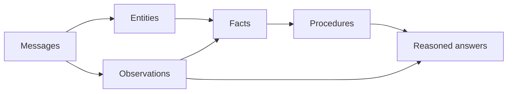

# uniko

## Cognitive memory for AI agents

uniko is an embedded, Rust-native cognitive memory system. It links into your agent
process like SQLite does — no Neo4j, no Qdrant, no PostgreSQL, no separate vector store to
keep consistent. Messages go in; compiled knowledge comes out, with full provenance. And
because knowledge is compiled at write-time by a local ONNX model cascade, there is **no LLM
in the recall hot path**: queries hit pre-derived Entities, Observations, and Facts instead
of re-deriving them on every call.

<div class="quick-links" markdown>
<a href="getting-started/installation/" class="quick-link">Install</a>
<a href="getting-started/quickstart/" class="quick-link">Quick Start</a>
<a href="concepts/architecture/" class="quick-link">Concepts</a>
<a href="benchmarks/" class="quick-link">Benchmarks</a>
<a href="https://github.com/rustic-ai/uniko" class="quick-link">GitHub</a>
</div>

---

## The agent memory gap

AI agents are stateless. They can pull text snippets out of a vector store, but they cannot
track who said what across sessions, notice when a fact changes, learn reusable procedures
from repeated experience, or explain why they believe something.

Existing memory systems each solve a piece. Mem0 gives you hybrid vector retrieval but no
graph and no temporal reasoning. Graphiti (Zep) gives you a temporal knowledge graph but
needs Neo4j and calls an LLM on every ingested turn. Letta leans on agent-managed memory
blocks with no structured extraction. None of them give you the complete cognitive stack,
and all of them require external infrastructure to operate.

uniko takes a different shape: memory is a typed knowledge graph organized around
communication. **Messages between Participants are the atomic unit, and everything else
derives from them with full provenance** — *who said what → what was observed → what was
learned → what works*.

---

## The core insight

The trick is *when* the work happens. Raw messages are like source code; consolidation
"compiles" them into reusable knowledge. The recall cascade then queries the compiled
knowledge, not the raw messages — the **compile once, query forever** principle.

Concretely, extraction runs a local ONNX model cascade (kniv-deberta, INT8-quantized,
"xsmall" tier) — a single encoder pass producing POS, NER, SRL, DEP, and CLS labels. No LLM
is called per message. That makes ingest cost predictable, offline-capable, and fast, while
recall stays cheap because the expensive derivation already happened at write time.



The pipeline is interaction-first. Entities are extracted from Messages. Observations are
statements found in Messages. Facts are consolidated from clusters of Observations.
Procedures are promoted from repeated Episodes. The provenance chain is always intact, so an
answer can be traced back to the Message that grounds it.

!!! note "Where reasoning runs today"
    uniko's design target is database-native rule execution via Locy. P5 invokes the
    `sequence_detector` Locy rule by name via a QUERY goal-query (RC12 resolved 2026-06-14;
    the earlier Cypher fallback was removed). The other three stdlib rules (`relevance_decay`,
    `episode_pattern_detector`, `contradiction_detector`) ship registered as Rule nodes but
    have no live caller yet. See [Reasoning with Locy](guides/reasoning-with-locy.md) for the
    full picture. The cognitive structure — Episodes becoming Procedures — is real and
    benchmarked.

---

## Headline benchmarks

Measured on the full LoCoMo benchmark (10 conversations, 1,986 questions) and against the
KTH `dmas-memory` testbed. Numbers are quoted exactly from the source benchmark reports.

=== "Recall quality (LoCoMo)"

    | Metric | uniko |
    |---|---|
    | LLM-judge (gemini-3.1) | **81.2%** |
    | Retrieval hit | 85.6% |
    | F1 | 0.321 |
    | Total LLM cost (1,986 q, incl. judging) | **$3.55** |

    For comparison, published competitor judge scores: Mem0 91.6%, Zep/Graphiti 75–84%,
    Letta 74.0%, LangMem 58.1%. uniko uses Mem0's verbatim judge prompt for comparability.

=== "Ingest throughput / cost"

    Full 5,882-turn LoCoMo corpus:

    | System | Total $ | Tokens | Wall (min) |
    |---|---|---|---|
    | **uniko** | **~$0** | **0** (local NLP) | **7.5** |
    | cognee | $1.32 | 6.7M | 493.47 |
    | mem0 | $4.82 | 51.7M | 250.95 |
    | graphiti | $5.49 | 34.6M | 568.97 |

    uniko ingests the full corpus in 7.5 minutes at $0 API cost — **33–76× faster** than the
    graph backends (Graphiti, Cognee) at the per-turn level, with zero LLM calls during
    ingest.

=== "Query latency"

    Per-question wall-time over 1,540 non-adversarial questions:

    | System | Avg wall | Total tokens/q |
    |---|---|---|
    | **uniko** | **4.04s** | **2,468** |
    | graphiti | 6.20s | 4,546 |
    | cognee | 6.99s | 4,780 |
    | full_context | 9.51s | 45,708 |

    uniko has the fastest Q&A wall time of all six systems measured, and uses roughly half
    the LLM tokens per query of either graph backend.

!!! tip "What this means"
    uniko's decisive ground is **ingest throughput, ingest cost, end-to-end query latency,
    and per-query token efficiency vs graph systems** — all while running fully in-process
    on consumer hardware (a 22-core CPU + an 8 GB consumer GPU runs the entire suite).

---

## See it in action

A `KnowledgeBase` is the single in-process handle over uni-db. You open one, ingest
`IngestMessage`s atomically, then `recall` a `ContextBundle` for a query.

```rust
use uniko_store::KnowledgeBase;
use uniko_store::config::UnikoConfig;
use uniko_extract::ingest::atomic::ingest_message_atomic;
use uniko_extract::ingest::context::SessionContext;
use uniko_memory::recall::{recall, RecallConfig};
use uniko_pipes::types::IngestMessage;
use chrono::Utc;
use std::collections::HashMap;

# async fn demo() -> uniko_store::Result<()> {
// 1. Open an embedded knowledge base — no external services.
let kb = KnowledgeBase::open("./agent-memory", UnikoConfig::default()).await?;

// 2. Ingest a message. Extraction (NER + NLP cascade + observations)
//    runs locally, then one atomic transaction writes the Message,
//    Entities, Observations, edges, and chunks — all-or-nothing,
//    idempotent on `message_id`.
let mut session_ctx = SessionContext::new("session-1".to_string(), 0);
let msg = IngestMessage {
    message_id: "m-1".to_string(),
    content: "Caroline researched coral reef restoration in Belize.".to_string(),
    content_type: "text".to_string(),
    sender_id: "melanie".to_string(),
    session_id: "session-1".to_string(),
    addressed_to: None,
    timestamp: Utc::now(),
    metadata: HashMap::new(),
};
ingest_message_atomic(&kb, &msg, &mut session_ctx).await?;

// 3. Recall compiled knowledge for a query — no LLM in this path.
let bundle = recall(&kb, "What did Caroline research?", &RecallConfig::default()).await?;
for item in &bundle.items {
    println!("{}: {}", item.node_type, item.content);
}
# Ok(())
# }
```

!!! note "Recall is a cascade, not a single lookup"
    `recall` runs a three-phase cascade: Phase 1 over compiled Facts / Topics / Procedures,
    Phase 2 hybrid vector + BM25 over Episodes / Observations / Messages fused with
    Reciprocal-Rank Fusion, and Phase 3 a full Chunk / Artifact fallback — gated by two
    coverage thresholds: the Phase-1 exit gate (default `0.75`) and the Phase-2→3 gate
    (default `0.65`). See [Recall](pipelines/recall.md) for details. Results assemble into a
    `ContextBundle` under a token budget, filtered by visibility policy.

---

## Next steps

<div class="feature-grid">
<div class="feature-card">
### [Getting Started](getting-started/installation.md)
Add uniko to your Rust project and ingest your first messages.
</div>
<div class="feature-card">
### [Concepts](concepts/architecture.md)
The cognitive model, the typed graph schema, and the recall cascade.
</div>
<div class="feature-card">
### [Benchmarks](benchmarks/index.md)
Full LoCoMo results and the head-to-head cost / latency comparison.
</div>
</div>
