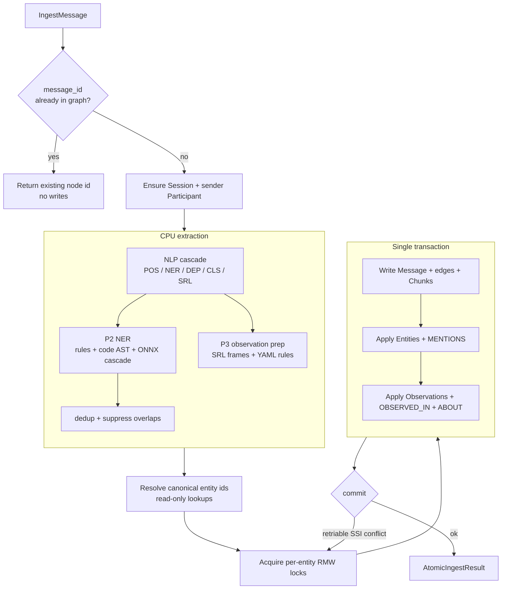

# Ingest Pipeline

Every memory in uniko starts as a [Message](../concepts/data-model.md). The ingest
pipeline is the path that turns one raw turn — text, code, structured data — into a
durable, queryable subgraph: the Message itself, its [Chunks](../concepts/data-model.md)
for vector search, the [Entities](../concepts/data-model.md) it mentions, and the
[Observations](../concepts/data-model.md) it asserts.

The design problem it solves is **fidelity under failure and concurrency**. An earlier
three-step path could persist a Message and then fail before its entities landed, leaving a
half-state ("Message persisted with no entities") in the graph. The current path folds all
CPU work and read-only lookups *before* a single transaction opens, then writes everything
at once. Failure is all-or-nothing; re-ingest is idempotent.



The whole flow lives in `crate::ingest::atomic::ingest_message_atomic`, which takes a
`&KnowledgeBase`, an `&IngestMessage`, and a `&mut SessionContext`, and returns an
`AtomicIngestResult`. The facade's `session.observe(Turn::new(...))` wraps this — the
`AtomicIngestResult` it produces is returned as `ObserveResult.message`.

```rust
use uniko_extract::ingest::atomic::ingest_message_atomic;

let result = ingest_message_atomic(kb, &msg, &mut session_ctx).await?;
// result.message_node_id, result.chunk_node_ids,
// result.extracted_entities, result.extracted_observations, ...
```

---

## P1 — Atomic ingest

`ingest_message_atomic` is the single per-message entry point. It performs four things in
order: an idempotency check, session/sender setup, CPU extraction, and one transactional
write.

### Idempotency on `message_id`

The first thing the function does is look up the Message by its external id:

```rust
if let Some((existing_id, _)) = kb
    .get_node_by_ext_id("Message", "message_id", &msg.message_id)
    .await?
{
    // Return the existing node id; no entities, observations, or chunks.
}
```

On a re-ingest the call returns an `AtomicIngestResult` whose `chunk_node_ids`,
`extracted_entities`, and `extracted_observations` are empty and whose `sender` is `None`.
Re-running the same conversation is therefore safe and cheap — duplicate Messages are never
created.

### All-or-nothing writes

All CPU work (NLP, NER, SRL, dedup) and read-only DB lookups happen **before** the
transaction opens. A single transaction then writes the Message, its edges and Chunks, the
Entities and `MENTIONS` edges, and the Observations with `OBSERVED_IN` and `ABOUT` edges,
and commits once.

!!! note "Failure semantics"
    Any error during extraction or in-transaction writes aborts the call; the transaction
    (if opened) is dropped without commit. No partial state persists for that message — the
    legacy "Message persisted with no entities" half-state cannot occur on this path.

### Concurrency: per-entity locks and retry

`entity_id` is non-unique in uni-db, so two concurrent ingests of the same entity could
both read "absent" and both create a duplicate row. To prevent that, the canonical entity
ids are computed first (`prepare_entity_upsert`), then the per-entity read-modify-write
locks are acquired *before* the transaction opens and held across the commit:

```rust
let entity_prep = prepare_entity_upsert(kb, deduped).await?;
let _entity_guards = kb.lock_entity_ids(&entity_prep.entity_ids).await;
```

The transaction body is wrapped in a retry loop driven by
`uniko_store::RetryOptions::default()`. A retriable uni-db SSI (serializable snapshot
isolation) conflict aborts the whole transaction — nothing persists — and a fresh attempt
re-reads entity existence authoritatively and recreates the rolled-back rows, so retries
never produce duplicates. The entity locks are held across every attempt.

!!! tip "Where session/sender setup commits"
    `ensure_session_and_sender` still uses its own commit per first-sight Session or
    Participant. So a brand-new conversation costs one ingest commit plus zero-to-two
    setup commits; a steady-state turn is a single commit.

`AtomicIngestResult` also carries an `AtomicTimings` struct with per-phase millisecond
counters (`nlp_ms`, `extract_ms`, `apply_entity_ms`, `apply_obs_ms`, `commit_ms`, …) that
are also emitted on the `tx_perf` tracing target for profiling.

---

## P2 — Named entity recognition

Entity extraction (`extract_entities_and_nlp`) layers three independent extractors, then
reconciles their output. Each contributes a `RawEntity` carrying a surface form, a
canonical name, an `EntityType`, a confidence, and an `ExtractionSource`.

=== "Rule-based (always)"

    `crate::ner::rules::extract_entities_rule_based` is a fast, dependency-free regex
    baseline that always runs. It covers URLs, emails, ISO and informal dates,
    measurements, `"I prefer …"` preferences, quoted strings, and multi-word proper nouns,
    emitting `EntityType` values like `Url`, `Email`, `Date`, `Measurement`, `Preference`,
    `QuotedString`, and `Person`. URL and email patterns are format-defined, so the regex
    extractor is treated as authoritative for them.

=== "Code AST (tree-sitter)"

    When the `code-parse` feature is on and the message `content_type == "code"`,
    `crate::ner::code::extract_code_entities` parses the source with **tree-sitter** and
    walks the full AST to collect function, class/struct/enum, and import names. Supported
    languages are Python, Rust, JavaScript, TypeScript, and TSX. AST parsing is
    deterministic, so these entities carry high confidence.

=== "ONNX cascade"

    With the `onnx` feature, the per-sentence NLP cascade (below) produces `NlpResult`s,
    and `crate::ner::onnx::entities_from_nlp_result` converts the model's NER spans into
    `RawEntity` values — mapping `NerEntityType` variants (`Person`, `Organization`,
    `Location`, `Date`, `Numeric`, …) onto uniko's `EntityType`. The model used is
    **kniv-deberta**, run through xervo, uni-db's model runtime.

After extraction, `suppress_onnx_over_structured` drops any ONNX-NER guess whose byte span
overlaps a format-structured rule entity (Email/URL) — keeping the regex entity as the
single canonical one — and `deduplicate_raw` collapses the remainder by canonical name,
keeping the highest-confidence extraction and accumulating a mention count.

!!! note "Feature gating"
    Extraction is feature-gated. Without `onnx`, rule-based plus code-AST extraction runs
    offline; with `onnx`, the ML cascade adds higher accuracy on top. Both paths produce a
    fully ingested subgraph.

### The NLP cascade

When `onnx` is enabled, `crate::nlp::NlpPipeline` wraps xervo's managed `NlpModel`. A
single `analyze` call runs tokenization, ONNX inference, and decoding for a configurable
task set, then `adapter::xervo_to_uniko` reconciles the output into uniko's `NlpResult`:

```rust
fn tasks(&self) -> NlpTasks {
    let mut tasks = NlpTasks::POS | NlpTasks::NER | NlpTasks::DEP | NlpTasks::CLS;
    if self.srl_enabled {
        tasks |= NlpTasks::SRL;
    }
    tasks
}
```

`analyze_sentences` first splits the message into sentences (dropping fragments under four
words), then analyzes each as a separate request so per-sentence token indexing for NER,
DEP, and SRL stays local to its sentence. SRL is gated by `UnikoConfig.nlp_srl_enabled`,
mirrored onto the pipeline as `srl_enabled`. If the runtime or the `nlp/default` alias is
unavailable, `NlpPipeline::try_new` returns `None` and callers fall back to rule-based
extraction.

---

## P3 — Observation extraction

Observations are the declarative facts a message asserts, anchored to known entities. The
key principle is that observations are **reconstructed from the dependency tree, not copied
from raw text fragments**: "I'm starting a dance studio" becomes a clean, speaker-attributed
"Jon is starting a dance studio".

The atomic path drives this through `prepare_observations` (pure CPU, run before the
transaction) and `apply_observations` (the in-transaction writer). Preparation has two
modes:

- **Model-driven** (`onnx`): for each per-sentence `NlpResult`, a multi-label CLS gate
  (`cls_gate_admits`) decides whether the sentence carries propositional content — admitting
  a sentence if any sufficiently-probable class belongs to the informative set (default
  `inform`, `status`, `request`, `offer`). Admitted sentences go to
  `rules_engine::extract_with_rules`, which combines the DEP tree, POS tags, and the
  sentence's **SRL frames** (`nlp_result.srl_frames`) against the YAML rule set.

- **Rule-based fallback** (`!used_model`): when no model results are available,
  `rules::extract_observations_rule_based` extracts observations from sentences that mention
  a known entity or match a strong pattern.

### The YAML rules engine

The rule set is a YAML document (the bundled `english.yml`, or an external file named by
`UnikoConfig.observation_rules_path`). It is loaded once and cached process-globally by
canonical path. Its `srl_patterns` are matched against each frame's predicate and arguments
by `rules_engine::matcher`, and a template fills in the resulting observation. Extracted
observations then pass through temporal resolution (`resolve_temporal_in_content`), which
substitutes an absolute date for a relative phrase using the message timestamp.

Each prepared `RawObservation` carries `content`, `subject`, `predicate`, `object`, an
optional `temporal_phrase` and resolved `temporal_anchor`, an `observed_at` timestamp, and
a confidence. `apply_observations` then writes them as Observation nodes with `OBSERVED_IN`
edges back to the Message and `ABOUT` edges to the mentioned entities.

!!! note "Sentence context carries across turns"
    Preparation seeds from and updates a `SentenceContext` (speaker, recent referents) so
    that pronoun resolution works across a conversation. The updated context is written
    back onto `SessionContext` only *after* a successful commit, so each retry re-seeds
    from the same unmutated state.

---

## Recursive chunking

For vector search, large content is split into Chunk nodes. In `apply_message_writes_in_tx`,
chunking runs only when the content is big enough — token count exceeds
`UnikoConfig.message_chunk_threshold` (default `1024`):

```rust
let chunk_threshold = kb.config().message_chunk_threshold;
let chunk_node_ids = if count_tokens(&msg.content) > chunk_threshold {
    let chunk_cfg = ChunkConfig::from_uniko_config(kb.config());
    let chunker = select_chunker(&msg.content_type, None);
    let chunks = chunker.chunk(&msg.content, &chunk_cfg);
    create_chunks_in_tx(kb, tx, &msg.message_id, message_nid, &chunks, "Message").await?
} else {
    Vec::new()
};
```

`select_chunker` picks a strategy by `content_type`, each one splitting along the natural
structure of its modality:

| content_type                          | Chunker             | Split hierarchy |
| ------------------------------------- | ------------------- | --------------- |
| `code` (with `code-parse` + supported lang) | `CodeChunker`  | tree-sitter AST boundaries |
| `html`                                | `HtmlChunker`       | DOM structure |
| `csv` / `json` / `structured`         | `StructuredChunker` | record/field structure |
| `text`, `tool_result`, `error`, `system`, unknown | `TextChunker` | paragraphs → sentences → words |

The default `TextChunker` is recursive and sentence-aware: it splits on paragraphs
(`\n\n`), then sentences, then words, targeting `max_chunk_tokens` (256 on the ingest path)
and never breaking mid-sentence. Chunk sizing comes from `ChunkConfig::from_uniko_config`,
so the effective ingest-path values are the `UnikoConfig` defaults: `max_chunk_tokens` 256,
`min_chunk_tokens` 32, and `chunk_overlap_tokens` 0 (0 means auto: ~10 % of max ≈ 25 tokens,
capped at 50). The standalone `ChunkConfig::default()` (512 / 64 / 50) is *not* the ingest
path. Token counts use the `cl100k_base` tokenizer via `count_tokens`, falling back to a
words × 1.3 approximation if the tokenizer cannot load.

Each `ChunkData` carries its text, index, byte offsets, token count, a `chunk_type`, and
modality-specific extras (language and `symbol_name` for code chunks, the nearest `heading`
for markdown/HTML). `create_chunks_in_tx` writes deterministic `chunk_id`s
(`uniko_store::id::chunk_id(parent_ext_id, index)`), so a retry recreates the same chunks
without duplication.

---

## P7 — Embedding

uniko leans on uni-db's **auto-embed**: Message, Chunk, Observation, and Summary nodes are
embedded automatically by uni-db when the schema configures an embedding config on the
vector index. No application code computes those vectors — writing the node is enough.

The default embedding model is **BGE-small-en-v1.5** (`BAAI/bge-small-en-v1.5`), 384
dimensions, resolved through the `embed/default` alias (`EMBED_ALIAS`). It is the default
in `UnikoConfig` via `EmbeddingConfig::bge_small_en_v15()`.

For *computed* embeddings — nodes whose text is synthesized from several properties, like an
Entity embedded as `"name (type)"` — `crate::embedding` provides explicit helpers:

```rust
use uniko_extract::embedding::{embed_document, embed_query, embed_entity};

// Document-side text (storage): applies the model's document_prefix.
let v = embed_document(kb, "Caroline Smith (Person)").await?;

// Query-side text (retrieval): applies the model's query_prefix.
let q = embed_query(kb, "who is Caroline?").await?;

// Convenience: compute and persist an Entity's embedding in one call.
embed_entity(kb, node_id, "Caroline Smith", Some("Person")).await?;
```

These helpers apply the correct model-specific prefix (`document_prefix` /
`query_prefix`) before embedding, since prefixing is part of how prefix-trained embedders
distinguish stored content from queries. For batch work, `embed_batch_chunked` issues a
large set of texts in fixed-size sub-batches (default 64) to keep each ONNX forward pass
within the runtime's memory arena while preserving order.

!!! note "Auto-embed vs. computed-embed prefixes"
    Auto-embed nodes (Message, Chunk, Summary) get the query prefix applied automatically
    inside `similar_to()` at search time. Use `embed_query` when you search computed-embedding
    nodes (such as Entities) directly.

---

## See also

<div class="feature-grid" markdown>
<div class="feature-card" markdown>
### [Domain Model](../concepts/data-model.md)
The node and edge types this pipeline writes: Message, Chunk, Entity, Observation.
</div>
<div class="feature-card" markdown>
### [Architecture](../concepts/architecture.md)
How uniko-extract (Layer 3) sits over uniko-store and uni-db.
</div>
</div>
