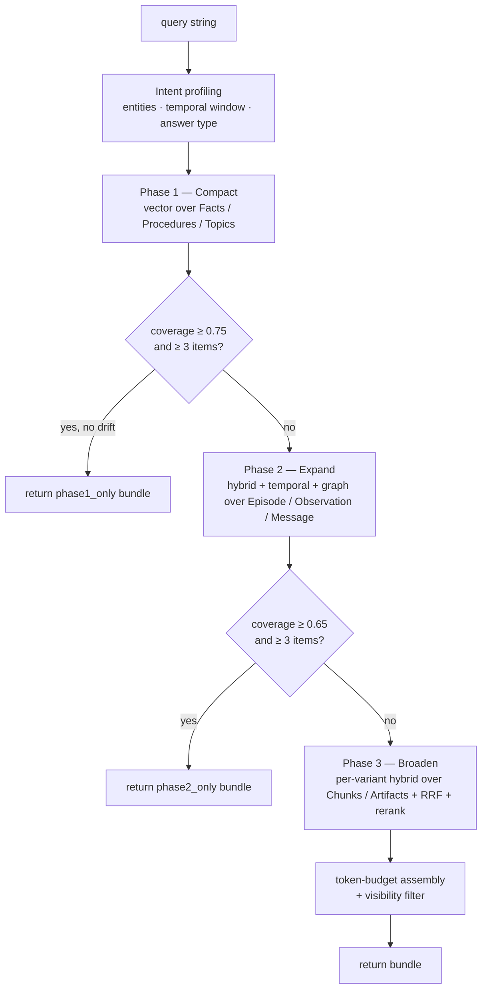
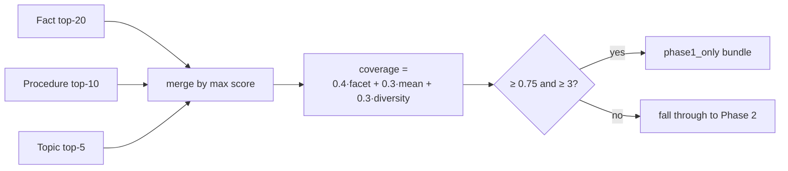

# Recall

Recall is the read side of uniko: given a natural-language query, return a ranked,
token-budgeted bundle of context drawn from the memory graph. The hard part is not
*finding* relevant nodes — vector search does that — but deciding **how hard to look**.
A question already answered by a consolidated Fact does not need a full sweep over raw
Chunks; a question about a volatile entity needs the opposite.

uniko answers that with a **three-phase recall cascade**. Each phase is progressively
broader and more expensive, and each phase can *short-circuit* the cascade if its results
already cover the question. The shape is borrowed from the system's tier model: compiled
knowledge first, episodic evidence second, raw text last.



The entry point is [`recall`](#the-entry-point), which takes a `KnowledgeBase`, the query,
and a `RecallConfig`. Everything below is governed by that config.

!!! note "Cold start"
    At cold start — before consolidation has produced any Facts, Procedures, or Topics —
    Phases 1 and 2 simply return nothing and the cascade falls through to Phase 3 (Broaden)
    over raw Chunks. The cascade is the same; the early tiers are just empty.

---

## Intent profiling

Before any search runs, the query is turned into an `IntentProfile` by `build_intent_at`.
This is **rule-based and model-light** — one NLP pass over the question, then pure regex and
graph lookups. No LLM call sits on the recall path.

The profile carries four signals that steer the later phases:

- **Entity refs** — named entities pulled from the question (via the NLP cascade's NER, or
  rule-based NER as a fallback) and normalised for graph matching (trailing punctuation and
  possessive `'s` stripped, so `Caroline's` matches the stored `Caroline`). These seed the
  Phase 2 graph channel.
- **Temporal window** — a half-open `[lo, hi)` interval resolved from phrases like *"last
  May"* via `resolve_temporal_with_granularity`. Relative phrases resolve against
  `RecallConfig.reference_ts` when set, falling back to `Utc::now()`. This drives the Phase 2
  temporal channel.
- **Expected answer type** — `predict_answer_type` runs high-precision regex over the surface
  form: *who* → `person`, *where* → `location`, *when* → `date`, *how many* → `measurement`,
  and so on. `None` when no rule fires (treated as "no signal", never "anything goes").
- **Query variants** — 1–4 reformulations of the query, each embedded concurrently. The
  default is the single POS-filtered `keywords` variant; the full set
  (`keywords`, `original`, `declarative`, `type_anchored`) is opt-in.

```rust
use uniko_memory::recall::{build_intent_at, IntentProfile};

let intent: IntentProfile =
    build_intent_at(&kb, "Where did Caroline go last May?", &[], reference_ts).await?;

assert_eq!(intent.expected_answer_type, Some("location"));
// intent.entity_refs == ["Caroline"], intent.temporal_window == Some((lo, hi))
```

!!! warning "Multi-variant is opt-in for a reason"
    The default `keywords`-only variant is deliberate. A measured A/B on full LoCoMo (757
    questions, 4 of 10 conversations, MiniLM cross-encoder reranker on GPU, 2026-05-04)
    showed multi-variant **regressing overall evidence% by 2.1 points and tripling
    per-query latency**. Pass `query_variants: vec!["keywords".into()]` to lock the legacy
    single-query behaviour, or list variants explicitly to experiment.

---

## Phase 1 — Compact

`phase1_compact` runs vector search over the consolidated **Semantic / Procedural** tier:
top-20 on `Fact.embedding`, top-10 on `Procedure.embedding`, top-5 on `Topic.embedding`,
all keyed on the intent's primary embedding. Hits below `RecallConfig.min_score` are dropped;
survivors are weighted by their tier (`Semantic` = 1.0, `Procedural` = 0.9).

!!! note "Procedure and Topic queries run, but return nothing yet"
    The Fact query is live. The `Procedure` and `Topic` queries are issued on every recall but
    return zero rows until those tiers are populated upstream — wiring them in is then a
    pure data-side change with no recall-code modification.

### The coverage gate

After Phase 1 collects items, `compute_coverage` scores how well they answer the question:

```
coverage = 0.4 · facet_coverage + 0.3 · mean_score + 0.3 · diversity
```

where `facet_coverage` is a proxy — `min(count of retrieved Semantic/Procedural items,
facet_count) / facet_count`, not a per-item entity match — `mean_score` is the average fused
score, and `diversity` counts
distinct tiers in the bundle (out of 5). If `coverage ≥ 0.75` **and** at least 3 items were
found, Phase 1 is "sufficient" and the cascade returns immediately with `phase1_only = true`
— the heavier phases never run.



### Drift override

There is one case where uniko refuses to trust the compiled view even when the gate passes.
If `drift_override_enabled` is on (default) and any query entity resolves to an `Entity`
flagged `unstable` (F39 drift), the Phase 1 early exit is **suppressed** and the cascade is
forced into Phase 2+ so recent episodic evidence is consulted. The lookup
(`any_unstable_entities`) only runs when Phase 1 *would* have exited early, so stable queries
pay nothing.

---

## Phase 2 — Expand

When Phase 1 misses its gate, `phase2_expand` searches the **episodic** tier. It RRF-fuses up
to five base sources, running them in parallel:

| Source | Mode | Field | top-k |
|---|---|---|---|
| `Episode` | vector | `action_type` | 20 |
| `Observation` | vector | `content` | 20 |
| `Message` | vector | `content` | 10 |
| `Observation` | fulltext (BM25) | `content` | 20 |
| `Message` | fulltext (BM25) | `content` | 10 |

Per-source scores are min-max normalised before fusion so cosine and BM25 ranges compare
like-for-like, then fused via reciprocal-rank fusion (`rrf_k`, default 60). Two more channels
fire conditionally on the intent:

=== "Temporal channel"

    Fires when the intent has a parsed `temporal_window` and `phase2_temporal_enabled` is on.
    `phase2_temporal` runs a single `temporal_window_hits` query (per-arm budget 20/20/10 over
    Fact / Observation / Episode) — a BTIC-overlap on `Fact.valid_at`, BTree-range scans on
    `Observation.temporal_anchor` and `Episode.timestamp`. Every hit gets a flat score; the
    window itself is the discriminator and the RRF rank is what flows downstream.

=== "Graph channel"

    Fires when the intent has entity refs and `phase2_graph_enabled` is on.
    `phase2_graph_activation` resolves the entities to seed `NodeId`s and runs edge-weighted
    personalized PageRank (`personalized_pagerank_weighted`) from those seeds. Edge weights
    bias propagation toward semantic relations (`ABOUT`, `MENTIONS` = 1.0, `SUPPORTED_BY` =
    0.9) and away from structural ones (`IN_SESSION` = 0.3, `FOLLOWED_BY` = 0.3). Seed nodes
    and bare `Entity`/`Participant` nodes are excluded from the output — they are anchors, not
    items to surface.

After fusion the Phase 2 bundle passes through **MMR deduplication** (`mmr_dedup` with
`phase2_mmr_lambda` = 0.7 and a Jaccard duplicate threshold of `0.85`) to drop near-identical
hits. Coverage is recomputed and checked against `phase2_coverage_gate` (default **0.65**);
if it clears and at least 3 items survive, the cascade returns with `phase2_only = true`.
Under the `Merge` strategy, up to 3 top Phase 1 Facts are merged into this bundle before it
returns.

```rust
use uniko_memory::recall::{RecallConfig, Phase1Strategy};

let cfg = RecallConfig {
    phase2_coverage_gate: 0.65,
    phase2_temporal_enabled: true,
    phase2_graph_enabled: true,
    phase2_graph_damping: 0.85,
    phase2_graph_max_iter: 30,
    ..RecallConfig::default()
};
```

!!! tip "Anchor relative time when recalling against a historical corpus"
    `reference_ts` defaults to `None` → `Utc::now()`. For a benchmark or archived corpus,
    set it to the question's anchor instant. Otherwise the temporal channel computes a window
    around *now* that never overlaps old data and silently disables itself.

---

## Phase 3 — Broaden

If neither gate clears, the cascade broadens to the full **KnowledgeBase** tier — Chunks and
Artifacts. This is where the multi-variant machinery does its work: each query variant runs
the full hybrid + entity-scoped pipeline (`recall_chunk_and_entity_scoped`, vector + BM25 over
session/observation chunks, weighted by `vector_weight` / `bm25_weight`) concurrently, and the
per-variant ranked lists are RRF-fused.

Fused candidates become `RecallItem`s carrying their tier weight (Observations, Chunks, and
Artifacts share the `KnowledgeBase` tier so Observations don't crowd Chunks out of the
bundle). Then two optional refinements apply, in order:

1. **Cross-encoder rerank** — when `reranker_enabled`, the top `reranker_top_n` (default 50)
   RRF candidates are re-scored by the cross-encoder registered at the rerank alias, with an
   optional sigmoid over the raw logits. **Enabled by default** (`RerankerConfig.enabled = true`);
   the runtime builds `RecallConfig` via `from_uniko_config`, so this is the effective default
   (standalone `RecallConfig::default()` has `reranker_enabled = false`). On failure the path
   falls back to RRF order rather than erroring.
2. **Answer-type boost** — when `answer_type_boost > 1.0` and the intent predicted a type,
   any of the top `answer_type_top_n` items whose connected entities match that type get their
   score multiplied. **Default 1.0 (no-op)**: the naive rule swamped top-K with off-target
   hits, measured at **−0.149 R@5 / −0.186 NDCG@5** on a 24-question LongMemEval slice
   (2026-05-03).

### How Phase 1 contributes to the final bundle

Phase 1 Facts can still influence the Phase 3 result, via one of three strategies set by
`RecallConfig.phase1_strategy`:

=== "Boost (default)"

    Facts never occupy bundle slots. Instead `session_boost_signals` walks each Fact to its
    containing session's Chunks
    (`Fact <-[:SUPPORTED_BY]- Observation -[:OBSERVED_IN]-> Message -[:IN_SESSION]-> Session -[:HAS_CHUNK]-> Chunk`)
    and adds `phase1_boost_alpha · fact_score` (default α = 0.6) to those chunks' scores. The
    bundle stays 100% Chunks, so gold-bearing text always surfaces. These are the effective
    `UnikoConfig` defaults (standalone `RecallConfig::default()` uses the `Merge` strategy with
    α = 0.3).

=== "Merge"

    The top 3 Phase 1 Facts are merged into the Phase 3 bundle by score (max-score
    deduplication per node id). This is the current best-known stack — conv-26 → 0.750,
    conv-30 → 0.802 with the rest of the stack.

=== "Off"

    No Phase 1 contribution — the bundle is Phase 3 + reranker output untouched.

### Bundle assembly and visibility filter

`finalize_bundle` sorts the items by score, truncates to `RecallConfig.limit` (default 15),
then walks them in rank order summing an estimated `TOKENS_PER_ITEM` (50) until
`token_budget` (default 8192) would be exceeded. The result is a `ContextBundle`:

```rust
pub struct ContextBundle {
    pub items: Vec<RecallItem>,
    pub total_tokens: usize,
    pub phase1_only: bool,   // cascade exited after Phase 1
    pub phase2_only: bool,   // cascade exited after Phase 2
    pub coverage: f64,
}
```

Finally, access control. `recall` wraps the cascade and applies `RecallConfig.viewer`:

- `ViewerScope::As(viewer)` filters the bundle through `policy::filter_bundle` so the viewer
  only sees Facts/Observations their visibility (private/team/org) admits.
- `ViewerScope::Unrestricted` (default) does no filtering — a *named, greppable* fail-open
  choice for trusted internal/bench callers. It logs a warning if the unfiltered bundle
  contains policy-scoped `Fact`/`Observation` items, so production callers serving a specific
  participant are nudged to set a viewer.

!!! warning "Set a viewer when serving a participant"
    The default is fail-open by design, but it is the wrong default for any caller answering
    on behalf of a specific user. Pass `ViewerScope::As(viewer)` to scope visibility.

---

## The entry point

```rust
use uniko_memory::recall::{recall, RecallConfig};

let cfg = RecallConfig::from_uniko_config(&uniko_cfg);
let bundle = recall(&kb, "What pet does Caroline have?", &cfg).await?;

for item in &bundle.items {
    println!("[{:?}] {:.3} {}", item.tier, item.score, item.content);
}
println!("coverage={:.2} tokens={}", bundle.coverage, bundle.total_tokens);
```

`RecallConfig::from_uniko_config` maps a `UnikoConfig` onto every recall knob —
`recall_limit`, `recall_token_budget`, the hybrid weights, the reranker settings, the Phase 2
gates and channels, and `phase1_strategy`. Construct it once per KB and reuse it.

---

## The query-episode learning loop

Recall is also the producer for uniko's procedure-promotion path (P5). The `query` module
turns a recall + answer pair into an `Episode` that cortex's P5 promotion later learns from.

There are two entry points:

- **`record_query_episode`** — the primitive. Given the question, the answer the caller
  produced, and the backing `ContextBundle`, it materialises an `Episode` under a Participant.
  The Episode's `state` JSON captures `question`, `answer`, `recall_node_ids`,
  `recall_coverage`, `recall_tokens`, and (when supplied) the answer model's token usage.
- **`answer_query`** — convenience wrapper that runs `recall` + the caller's generator closure
  + (optional) `record_query_episode` in one call. uniko deliberately does **not** own LLM
  selection or prompts; the generator is a closure so the caller brings their own model.

Recording is **opt-in** — pass `QueryRecordOptions` to enable it. Recording failures are
logged at debug and surface as `episode_id = None`; they never break a user-visible answer.

```rust
use uniko_memory::{answer_query, GeneratedAnswer, QueryRecordOptions};

let outcome = answer_query(
    &kb,
    question,
    &recall_config,
    |bundle, q| async move {
        // caller owns the LLM call; build context from bundle.items
        Ok(GeneratedAnswer {
            text: generated,
            input_tokens: None,
            output_tokens: None,
            model: Some("gpt-4o-mini".into()),
        })
    },
    Some(QueryRecordOptions {
        participant_id: "agent-1".into(),
        outcome: Some("success".into()),
        ..Default::default()
    }),
).await?;

// outcome.bundle, outcome.answer, outcome.episode_id
```

!!! note "Why recording lives in `uniko-memory`"
    Episodes are the *input* to P5 procedure promotion. Keeping recording in the memory crate
    means any library-only caller feeds P5 — placing it in a higher layer would silently
    starve promotion for direct callers.
