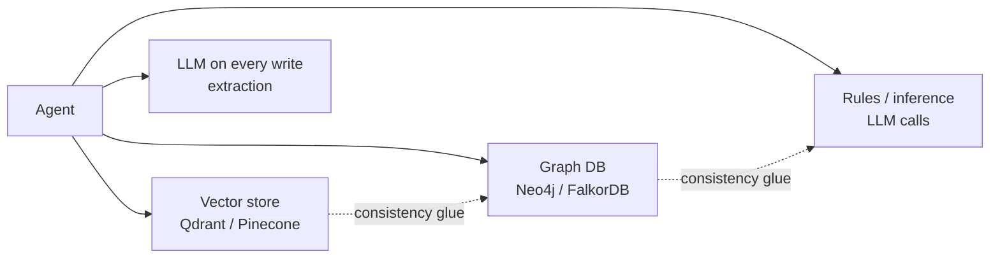

# Why uniko

Agent memory today is an integration project. You pick a vector store for recall, bolt on a
graph database when flat text stops being enough, wire in a rules layer for anything
resembling inference, and write glue to keep them consistent. Every one of those pieces is a
separate service to operate, a separate consistency boundary to reason about, and — in most
designs — another LLM call on the write path.

uniko takes the opposite position. Memory is **one typed knowledge graph organized around
communication**, living inside a single embedded database. Messages are the atomic unit;
entities, observations, facts, procedures, and topics are derived from them with full
provenance. The graph, the vectors, the full-text index, and the logic engine are all the
same database — [uni-db](https://github.com/rustic-ai/uni-db) — running in your process.

---

## The problem with bolt-on memory

A typical "agent memory" stack stitches together two to four systems:

Three costs follow from this shape:

- **Infrastructure cost.** Each backend is a service to deploy, secure, back up, and keep in
  sync. The graph and the vectors drift apart; reconciling them is your problem.
- **Ingest cost.** Most systems call an LLM per message to extract entities and facts. That
  is money and latency on the hot path, and it makes ingest network-bound and offline-hostile.
- **Inference cost paid every time.** When reasoning lives in an LLM at query time, you pay
  for the same derivation on every question instead of compiling it once.

uniko removes all three by design.

---

## What makes uniko different

uniko's differentiators come straight from the spec's design goals. Each one is a structural
consequence of "one graph, in-process, compiled at ingest."

### Zero infrastructure
A single in-process database (uni-db) provides graph, vector, full-text, and logic in one
engine. It links into your process like SQLite — no Neo4j, no Qdrant, no network hop, nothing
to keep consistent.

### No LLM in the ingest hot path
Entity and observation extraction run a local ONNX NLP cascade
(POS / NER / SRL / DEP / CLS) on commodity hardware. Ingest costs **zero LLM tokens per
message** by default; LLM work (triple refinement, topic naming) is optional and asynchronous.

### Interaction-first schema
Message, Session, and Participant are first-class nodes. Everything traces back to "who said
what": Observations are statements found in Messages, Facts consolidate Observations,
Procedures promote from repeated Episodes. Provenance is the schema, not metadata bolted on.

### Goal-oriented working memory
Working memory is not a chat buffer. It is everything relevant to an active Goal, assembled
by traversing Goal → Task → Session → Message → Fact → Entity. Change the goal and the context
recomputes from the graph.

### Formal reasoning over the graph
uni-db's Locy logic layer lets rules execute **inside the database**. The "compile once, query
forever" principle: pay extraction once at ingest, then query compiled knowledge — facts,
procedures, topics — instead of re-deriving with an LLM on every call.

### Bitemporal knowledge
Facts carry BTIC temporal intervals with per-bound certainty. When a later message contradicts
an earlier one, the old fact is invalidated and the new one takes precedence — with the history
preserved, not overwritten.

!!! note "Compile once, query forever"
    Raw messages are the "source code." Consolidation compiles them into Facts and Procedures.
    The recall cascade queries the compiled knowledge, not the raw messages. The LLM pays the
    extraction cost once; every subsequent query benefits for free.

!!! note "Honest note on the Locy path"
    Procedure promotion (P5) invokes the `sequence_detector` Locy rule by name via a `QUERY`
    goal-query (RC12 resolved 2026-06-14; the earlier Cypher fallback was removed). The other
    three stdlib rules ship registered as Rule nodes but have no live caller yet. See
    [Reasoning with Locy](guides/reasoning-with-locy.md) for the full picture.

---

## Honest comparison

uniko is one entrant in a landscape of six. Each competitor solves a piece well. The tables
below quote published competitor figures and uniko's own measured runs exactly as they appear
in the source documents.

### Where everyone sits

| System | Architecture | LoCoMo |
|---|---|---|
| **Mem0** | Vector + SQLite + optional entity boost | 91.6% |
| **Graphiti** (Zep) | Temporal knowledge graph (Neo4j / FalkorDB) | 75–84% |
| **Letta** (MemGPT) | PostgreSQL + agent-managed memory blocks | 74.0% |
| **LangMem** | LangGraph BaseStore, vector-only | 58.1% |
| **Cognee** | Graph + Vector + Relational + Cache | — |
| **uniko** | Single embedded uni-db (graph + vector + FTS + Locy) | **81.2%** |

uniko's LoCoMo result is **LLM-judge 81.2%** on the full 10 conversations (1,986 questions),
with retrieval hit 85.6%, F1 0.321, and total LLM cost **$3.55** (gemini-3.1, 2026-05-26). The
pre-v6 prototype scored **22.2%**; the trajectory from 22% to 81% validates the interaction-first
redesign. uniko's judge uses Mem0's verbatim judge prompt for comparability. The remaining gap
to Mem0 is an active workstream, driven largely by date-anchored questions.

!!! note "Different systems require different infrastructure"
    Every competitor requires an external service: Graphiti needs Neo4j or FalkorDB, Mem0 needs
    a vector store such as Qdrant, Cognee needs Graph + Vector + Relational backends. uniko runs
    entirely in-process.

### Cost and latency vs the KTH dmas-memory baseline

The strongest measured ground is **ingest throughput / cost** and **end-to-end query latency**.
The figures below come from the KTH dmas-memory comparison (Wolff & Bennati, KTH,
[arXiv:2601.07978](https://arxiv.org/abs/2601.07978)), measured 2026-06-14, unconstrained
network mode, over the same LoCoMo10 question set.

!!! note "Two question sets — don't conflate them"
    The 81.2% judge figure above is the full 1,986-question LoCoMo10 run; the KTH cost and
    latency tables below use the 1,540-question non-adversarial subset.

=== "Loading (ingest) — full 5,882-turn corpus"

    | System | Total $ | Tokens | Wall (min) | per-turn ms |
    |---|---|---|---|---|
    | **uniko** | **~$0** | **0** (local NLP) | **7.5** | **76** |
    | full_context | $0.00 | 0 | 21.08 | ~215 |
    | rag | $0.006 | 308k | 40.29 | ~411 |
    | cognee | $1.32 | 6.7M | 493.47 | ~5031 |
    | mem0 | $4.82 | 51.7M | 250.95 | ~2560 |
    | graphiti | $5.49 | 34.6M | 568.97 | ~5804 |

    uniko ingests the full corpus in **7.5 minutes at $0 API cost** by running a local NLP
    cascade and making **zero LLM API calls during ingest**. Against the graph backends
    (Graphiti, Cognee) it is **33–76× faster** at the per-turn level and avoids $1.32–$5.49 of
    ingest cost per corpus.

=== "Q&A — per question (1,540 questions)"

    | System | Answer $/q | Total $ | Avg wall | Total tok |
    |---|---|---|---|---|
    | mem0 | **$0.000179** | $0.28 | 4.56s | 1235 |
    | rag | $0.000259 | $0.40 | 4.34s | 1790 |
    | **uniko** | $0.000657 | $1.01 | **4.04s** | **2468** |
    | graphiti | $0.000657 | $1.01 | 6.20s | 4546 |
    | cognee | $0.000715 | $1.10 | 6.99s | 4780 |
    | full_context | $0.006786 | $10.45 | 9.51s | 45708 |

    uniko has the **fastest Q&A wall time of all six systems** (4.04s) and uses **roughly half
    the total LLM tokens per query** of either graph backend (2468 vs Graphiti 4546, Cognee
    4780). Its answer cost ties Graphiti and is ~3.7× mem0's — entirely attributable to a larger
    retrieved context (2435 vs 752 input tokens), which is a recall-budget tuning lever, not an
    architectural floor.

!!! tip "The one-line summary from the KTH comparison"
    uniko is the only system of six that ingests LoCoMo in under 10 minutes at $0 API cost, and
    the only one with sub-4-second mean Q&A wall-time. Against the graph backends it is 33–76×
    faster at ingest and uses roughly half the LLM tokens per query.

### Where uniko trails — stated plainly

- **Q&A cost-per-question vs Mem0.** Mem0's tighter retrieval wins on per-query token cost.
  uniko over-retrieves (2435 input tokens vs 752); this is tunable via the recall token budget.
- **LoCoMo judge score vs Mem0** (91.6% vs uniko's 81.2%). Closing the gap is an active
  workstream, led by date-anchored recall, where ~34% of single-hop failures currently land.

---

## Who uniko is for

uniko is a **Rust library** that embeds cognitive memory into your agent's process. It fits when:

- **You want zero operational footprint.** No external graph DB, no vector store, no managed
  service. The whole memory system — database, NLP cascade, embeddings, optional reranker —
  runs in-process on consumer hardware.
- **Ingest cost and offline capability matter.** Local extraction means predictable, $0-token
  ingest with no per-message network dependency.
- **Conversation and provenance are central.** You need to track who said what across many
  sessions, attribute statements to speakers, and explain why a fact is believed — not just
  retrieve nearby text.
- **You are organizing memory around goals.** Working memory assembled by traversing
  Goal → Task → Session is a first-class concept, not something you reconstruct yourself.
- **You value graph-native reasoning.** Facts, procedures, and topics are compiled at ingest
  and queried directly, with Locy logic available inside the database.

If your needs are pure nearest-neighbor text recall with the absolute lowest per-query token
cost, a tuned vector system like Mem0 may suit you better today. uniko's bet is the combination
no other shipping system offers: an embedded, conversation-native, goal-oriented memory graph
with formal reasoning, at zero ingest cost.

---

## Next steps

### [Architecture](concepts/architecture.md)
How the pipelines, recall cascade, and storage layer fit together.

### [Getting started](getting-started/installation.md)
Add uniko to a Rust project and ingest your first messages.

