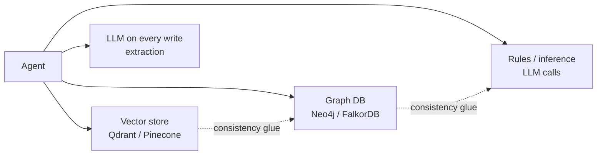

# Why uniko

uniko is the embedded memory layer for AI agents. It links into your process like SQLite, costs
$0 to ingest, and reasons over what it stores. This page covers the problem it solves, the
category it defines, and how it compares.

---

## Agents are stateless. Memory is the missing layer.

An agent can pull text snippets from a vector store, but it cannot track who said what across
sessions, notice when a fact changes, learn a procedure from repeated experience, or explain why
it believes something. Those are different jobs, and a flat embedding index does none of them.

---

## A bolt-on stack charges you three times

The usual answer stitches together two to four systems:

- **Infrastructure cost.** Each backend is a service to deploy, secure, back up, and keep in
  sync. The graph and the vectors drift apart, and reconciling them is your problem.
- **Ingest cost.** Per-message LLM extraction is money and latency on the write path, and it makes
  ingest network-bound and offline-hostile.
- **Inference cost, paid every time.** When reasoning lives in an LLM at query time, you pay for
  the same derivation on every question.

uniko removes all three by design.

---

## One typed knowledge graph, in your process

Memory is a single typed knowledge graph organized around communication, living inside one
embedded database. Messages are the atomic unit; entities, observations, facts, procedures, and
topics derive from them with full provenance. The graph, the vectors, the full-text index, and the
Locy logic engine are the same database — [uni-db](https://github.com/rustic-ai/uni-db) — running
in your process.

---

## Every advantage follows from one decision

One graph, in-process, compiled at ingest. Each differentiator below is a structural consequence
of that choice.

### Zero infrastructure
A single in-process database (uni-db) provides graph, vector, full-text, and logic in one engine.
It links into your process like SQLite — no Neo4j, no Qdrant, no network hop, nothing to keep
consistent.

### No LLM in the ingest hot path
Entity and observation extraction run a local ONNX NLP cascade (POS / NER / SRL / DEP / CLS) on
commodity hardware. Ingest costs **zero LLM tokens per message**; LLM work (triple refinement,
topic naming) is optional and asynchronous.

### Interaction-first schema
Message, Session, and Participant are first-class nodes. Everything traces back to "who said
what": Observations are statements found in Messages, Facts consolidate Observations, Procedures
promote from repeated Episodes. Provenance is the schema, not metadata bolted on.

### Goal-oriented working memory
Working memory is not a chat buffer. It is everything relevant to an active Goal, assembled by
traversing Goal → Task → Session → Message → Fact → Entity. Change the goal and the context
recomputes from the graph.

### Formal reasoning over the graph
uni-db's Locy logic layer runs rules **inside the database**. Pay extraction once at ingest, then
query compiled knowledge — facts, procedures, topics — instead of re-deriving with an LLM on every
call.

### Bitemporal knowledge
Facts carry BTIC temporal intervals with per-bound certainty. When a later message contradicts an
earlier one, the old fact is invalidated and the new one takes precedence — with the history
preserved, not overwritten.

!!! note "Compile once, query forever"
    Raw messages are the source code. Consolidation compiles them into Facts and Procedures, and
    the recall cascade queries that compiled knowledge — never the raw stream. Extraction is paid
    once; every subsequent query benefits.

!!! note "Reasoning runs inside the database"
    Procedure promotion invokes the `sequence_detector` Locy rule via a `QUERY` goal-query, turning
    repeated Episodes into reusable Procedures — benchmarked end to end. See
    [Reasoning with Locy](guides/reasoning-with-locy.md) for the full picture.

---

## How uniko compares

uniko is the only embedded, zero-infrastructure memory system in its class, and it backs that with
the numbers that gate a production deployment: **$0 ingest cost, 33–76× faster ingest than graph
backends, and the fastest Q&A latency of any system measured (4.04s)**. The tables below are
head-to-head, every figure quoted from the source reports.

### Where everyone sits

| System | Architecture | LoCoMo |
|---|---|---|
| **Mem0** | Vector + SQLite + optional entity boost | 91.6% |
| **Graphiti** (Zep) | Temporal knowledge graph (Neo4j / FalkorDB) | 75–84% |
| **Letta** (MemGPT) | PostgreSQL + agent-managed memory blocks | 74.0% |
| **LangMem** | LangGraph BaseStore, vector-only | 58.1% |
| **Cognee** | Graph + Vector + Relational + Cache | — |
| **uniko** | Single embedded uni-db (graph + vector + FTS + Locy) | **81.2%** |

uniko scores **81.2%** on the full LoCoMo10 (1,986 questions), with retrieval hit **85.6%**, F1
**0.321**, and total LLM cost of **$3.55** (gemini-3.1, 2026-05-26, using Mem0's verbatim judge
prompt) — delivered from one embedded graph instead of a stack of external services.

!!! note "Different systems require different infrastructure"
    Every competitor requires an external service: Graphiti needs Neo4j or FalkorDB, Mem0 needs a
    vector store such as Qdrant, Cognee needs Graph + Vector + Relational backends. uniko runs
    entirely in-process.

### Cost and latency vs the KTH dmas-memory baseline

uniko's strongest measured ground is **ingest throughput / cost** and **end-to-end query latency**.
The figures come from the KTH dmas-memory comparison (Wolff & Bennati, KTH,
[arXiv:2601.07978](https://arxiv.org/abs/2601.07978)), measured 2026-06-14, unconstrained network
mode, over the same LoCoMo10 question set.

!!! note "Two question sets — don't conflate them"
    The 81.2% judge figure above is the full 1,986-question LoCoMo10 run; the KTH cost and latency
    tables below use the 1,540-question non-adversarial subset.

=== "Loading (ingest) — full 5,882-turn corpus"

    | System | Total $ | Tokens | Wall (min) | per-turn ms |
    |---|---|---|---|---|
    | **uniko** | **~$0** | **0** (local NLP) | **7.5** | **76** |
    | full_context | $0.00 | 0 | 21.08 | ~215 |
    | rag | $0.006 | 308k | 40.29 | ~411 |
    | cognee | $1.32 | 6.7M | 493.47 | ~5031 |
    | mem0 | $4.82 | 51.7M | 250.95 | ~2560 |
    | graphiti | $5.49 | 34.6M | 568.97 | ~5804 |

    uniko ingests the full corpus in **7.5 minutes at $0 API cost**, making **zero LLM API calls
    during ingest**. Against the graph backends (Graphiti, Cognee) it is **33–76× faster** at the
    per-turn level and avoids $1.32–$5.49 of ingest cost per corpus.

=== "Q&A — per question (1,540 questions)"

    | System | Answer $/q | Total $ | Avg wall | Total tok |
    |---|---|---|---|---|
    | mem0 | $0.000179 | $0.28 | 4.56s | 1235 |
    | rag | $0.000259 | $0.40 | 4.34s | 1790 |
    | **uniko** | $0.000657 | $1.01 | **4.04s** | **2468** |
    | graphiti | $0.000657 | $1.01 | 6.20s | 4546 |
    | cognee | $0.000715 | $1.10 | 6.99s | 4780 |
    | full_context | $0.006786 | $10.45 | 9.51s | 45708 |

    uniko has the **fastest Q&A wall time of all six systems** (4.04s) and uses **half the total
    LLM tokens per query** of either graph backend (2468 vs Graphiti 4546, Cognee 4780). Its answer
    cost is driven by a larger retrieved context (2435 input tokens) — a recall-budget setting you
    tune, not an architectural floor.

!!! tip "The one-line summary from the KTH comparison"
    uniko is the only system of six that ingests LoCoMo in under 10 minutes at $0 API cost, and the
    only one with sub-4-second mean Q&A wall-time. Against the graph backends it is 33–76× faster at
    ingest and uses half the LLM tokens per query.

---

## Who uniko is for

uniko is a **Rust library** that embeds cognitive memory into your agent's process. It fits when:

- **You want zero operational footprint.** No external graph DB, no vector store, no managed
  service. The whole memory system — database, NLP cascade, embeddings, optional reranker — runs
  in-process on consumer hardware.
- **Ingest cost and offline capability matter.** Local extraction means predictable, $0-token
  ingest with no per-message network dependency.
- **Conversation and provenance are central.** You track who said what across many sessions,
  attribute statements to speakers, and explain why a fact is believed — not just retrieve nearby
  text.
- **You organize memory around goals.** Working memory assembled by traversing
  Goal → Task → Session is a first-class concept, not something you reconstruct yourself.
- **You value graph-native reasoning.** Facts, procedures, and topics are compiled at ingest and
  queried directly, with Locy logic available inside the database.

uniko is built for what no other shipping system offers: an embedded, conversation-native,
goal-oriented memory graph with formal reasoning, at zero ingest cost. If your product depends on
remembering people, facts, and procedures across sessions — in your own process — this is the layer
for it.

---

## Next steps

### [Architecture](concepts/architecture.md)
How the pipelines, recall cascade, and storage layer fit together.

### [Getting started](getting-started/installation.md)
Add uniko to a Rust project and ingest your first messages.

